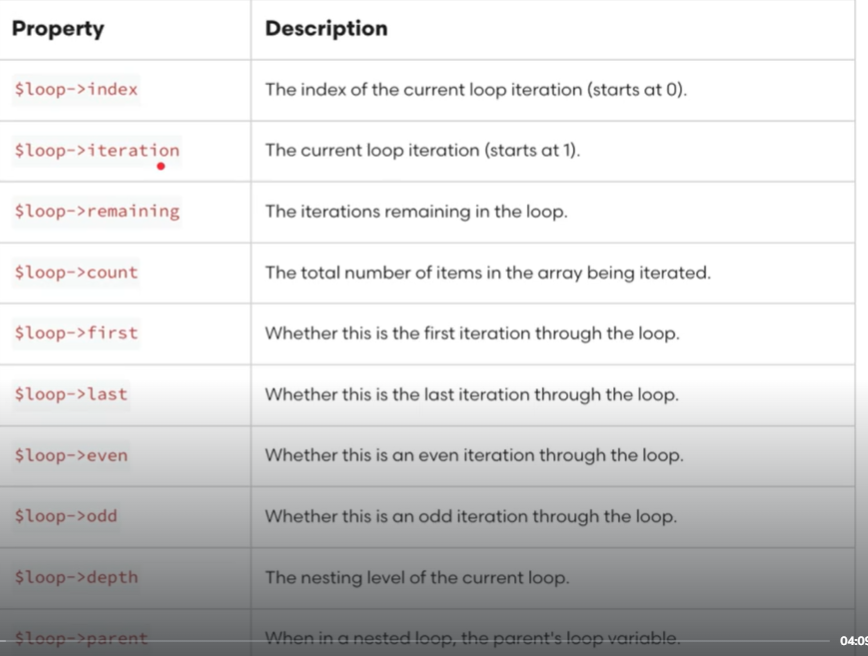
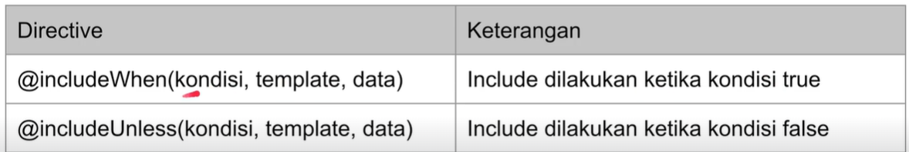
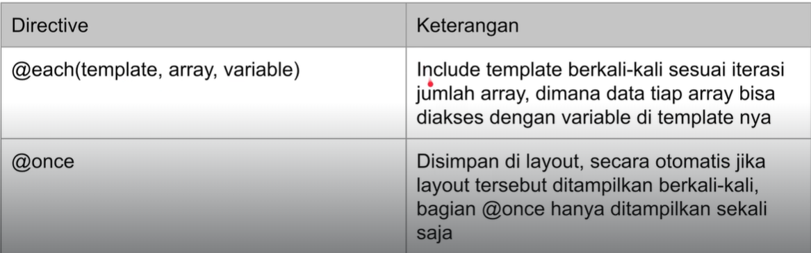
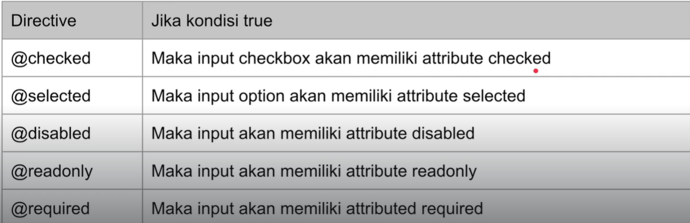

# Blade

## Introduction

Blade adalah fitur di laravel yang digunakan untuk mempermudah dalam pembuatan tampilan halaman web HTML. Dengan blade template bisa kita bedakan lokasi logic aplikasi dengan kode tampilan. Semua blade template disimpan dalam folder resources/views.

## Variable
Di blade kita bisa menampilkan variable php menggunakan $ seperti contoh : **{{$nama}}**. Dengan demikian variable tersebut akan dirender ke template html.
Sebagai contoh kita akan buat file **hello.blade.php**.
```php
<html lang="en">

<head>
    <meta charset="UTF-8">
    <meta name="viewport" content="width=device-width, initial-scale=1.0">
    <title>{{$name}}</title>
</head>

<body>
    <h1>{{$name}}</h1>
</body>

</html>
```
Kemudian untuk routingnya:
```php
Route::get('/hello', function(){
    return view('hello', [
        'name' => "alphonso"
    ]);
});
```

Sebagai unit testnya:
```php
public function testHello()
    {
        $this->get('/hello')
        ->assertSeeText('alphonso');
    }
```

## Nested View Directory
Jika file view yang kita buat sudah banyak, lebih baik disimpan di berbagai folder untuk skalabilitas yang baik. Sebagai contoh terdapat file profile.blade.php dan ingin ditaro pada folder admin. Maka untuk aksesnya maka gunakan **admin.profile**.

## Test View Tanpa Routing
Untuk melakukan test kita harus membuat routenya dlu, namun di laravel bisa juga tanpa membuat routenya untuk unit testnya. Sebagai contoh:
```php
public function testViewWithoutRoutinh()
    {
        $this->view('hello.hello', [
            'name' => 'jonathan'
        ])->assertSeeText('jonathan');
    }
```

## Comment
Blade juga mendukung untuk komentar, caranya mengunakan {{-- isi komentar --}}.

## HTML Encoding
By default ketika menampikan data menggunakan {{}} maka otomatis akan melakukan sanitasi. Jika ingin data yang ditampilkan tidak disanitasi maka  bisa menggunakan seperti ini {!! $variable !!}. Sebagai contoh:
```php
<html lang="en">

<head>
    <meta charset="UTF-8">
    <meta name="viewport" content="width=device-width, initial-scale=1.0">
    <title>HTML Encoding</title>
</head>

<body>
    {!! $name !!}
</body>

</html>
```
Untuk diroutenya
```php
Route::get('/html-encoding', function (Request $request) {
    return view('html-encoding', [
        'name' => $request->input('name')
    ]);
});
```

## Disabled Blade
Ada beberapa kasus dimana kita tidak ingin code blade tereksekusi di html karena beberapa syntax yang sama dengan blade. Oleh karena itu kita bisa tambahkan @ sebelumnya untuk escape blade function atau jika banyak code yang ingin diescape maka bisa menggunakan @verbatim - @endverbatim. Sebagai contoh:
```php
<html lang="en">

<body>
    <h1>Hello @{{$name}}</h1>

    @verbatim
    <p>
        Hello {{$name}}
        Hello {{$name}}
        Hello {{$name}}
        Hello {{$name}}
    </p>
    @endverbatim
</body>

</html>
```

Untuk unit testnya:
```php
public function testDisabled()
    {
        $this->view('disabled', [
            'name' => 'dono'
        ])->assertSeeText(' Hello {{$name}}')
            ->assertDontSeeText('dono');
    }
```

## If Statement
Blade template juga mendukung percabangan if menggunakan perintah/directive @if, @elseif, @else dan @endif. Contoh:
```php
<!DOCTYPE html>
<html lang="en">

<body>
    <p>
        @if (count($hobbies) == 1)
            I just only have one hobbies.
        @elseif(count($hobbies) > 1)
            I have many hobbies
        @else
            I dont have any hobbies
        @endif
    </p>
</body>
</html>
```
Untuk unit testnya:
```php
public function testIf()
    {
        $this->view('if', [
            'hobbies' => []
        ])->assertSeeText('I dont have any hobbies');

        $this->view('if', [
            'hobbies' => ['games']
        ])->assertSeeText('I just only have one hobbies.');

        $this->view('if', [
            'hobbies' => ['football', 'soccer']
        ])->assertSeeText('I have many hobbies');
    }
```

## Unless Statement
Mirip seperti ini dengan @if namun jika nilainya false, maka isi body akan dieksekusi.
```php
<html lang="en">

<body>
    @unless ($isAdmin)
    You are not admin
    @endunless
</body>

</html>
```

## Isset and Empty
@Isset digunakan untuk mengecek apakah sebuah variable ada dan tidak bernilai null.

@empty digunakan untuk mengecek apakah sebuah variable merupakan array kosong.

Contoh 
```php
<!DOCTYPE html>
<html lang="en">
<body>
    <p>
        @isset($name)
            Welcome {{$name}} in my web.
        @endisset
    </p>
    <p>
        @empty($hobbies)
            I dont have any hobbies.
        @endempty
    </p>
</body>
</html>
```

## Env
Dalam blade template , bisa menggunakan directive @env(name) untuk mengecek env yang digunakan. Contoh:
```php
<!DOCTYPE html>
<html lang="en">
<body>
    @env('test')
        This is test environment
    @endenv
</body>
</html>
```
## Switch Statement
Dalam blade template juga bisa dilakukan switch statement case menggunakan @switch. Contoh:
```php
<html lang="en">

<body>
    @switch($value)
    @case('A')
        Memuaskan
    @break

    @case('B')
        Bagus
    @break

    @case('C')
        Cukup
    @break
    
    @default
        Tidak Lulus
    @endswitch
</body>

</html>
```
## Loop

### For Loop
Contoh implementasi:
```php
<!DOCTYPE html>
<html lang="en">

<body>
    <ul>
        @for ($i = 0; $i < $limit; $i++) <li>{{$i}}</li>
            @endfor
    </ul>
</body>

</html>
```

## Foreach Loop
untuk melakukan directive loop terhadap data yang ingin ditampilkan. Contoh:
```php
<!DOCTYPE html>
<html lang="en">

<body>
    <ul>
        @foreach ($hobbies as $hobby)
            <li>{{$hobby}}</li>
        @endforeach
    </ul>
</body>
</html>
```

### ForElse Loop
Untuk membuat kondisional jika data yang diberikan tidak ada. Contoh:
```php
<!DOCTYPE html>
<html lang="en">

<body>
    <ul>
        @forelse ($hobbies as $hobby)
            <li>{{$hobby}}</li>
        @empty
            <li>Tidak ada Hobi</li>
        @endforelse
    </ul>
</body>
</html>
```

### While Loop
Laravel mendukung perulangan menggunakan while, sebagai contoh:
```php
<html lang="en">
<body>
    @while ($i < 10)
        Current Value is {{$i}}
        @php
            $i++;
        @endphp
    @endwhile
</body>
</html>
```

### Loop Variable
Ketika melakukan looping forEach, kita ingin mengakses beberapa variable seperti iterasi dll.


Contoh implementasi:
```php
<html lang="en">
<body>
    <ul>
        @foreach ($hobbies as $hobby)
            <li>{{$loop->iteration}}. {{$hobby}}</li>
        @endforeach
    </ul>
</body>
</html>
```

## CSS Class
Untuk implementasi css class pada element berdasarkan output dari backend. Contoh:
```php
<!DOCTYPE html>
<html lang="en">

<head>
    <style>
        .red {
            color: red;
        }

        .bold {
            font-weight: bold;
        }
    </style>
</head>

<body>
    <ul>
        @foreach ($hobbies as $hobby)
        <li @class(['red', 'bold'=> $hobby['love']])>{{$hobby['name']}}</li>
        @endforeach
    </ul>
</body>

</html>
```
## Include

### Include basic
Saat kita ingin membuat halaman web, ada beberapa bagian yang sama. Oleh karenanya kita dapat membuat template layout kemudian menggunakan directive include untuk mengambil template tersebut.
Sebagai Contoh:

header.blade.php
```php
@isset($title)
    <h1>{{$title}}</h1>
@else
    Alphonso
@endisset
```

include.blade.php
```php
<!DOCTYPE html>
<html lang="en">
<body>
    @include('header')
    <p>Welcome...</p>
</body>
</html>
```
### Include Parameter
Secara default, semua data yang dikirim ke template utama akan dikirim ke template yang kita @include. Namun jika ingin menambah parameter tambahanm bisa menggunakan directive @include(template, data).

Contoh:
```php
@isset($title)
    <h1>{{$title}}</h1>
@else
    Alphonso
@endisset

@isset($description)
    <p>{{$description}}</p>
@endisset
```

Kemudian pada includenya:
```php
<!DOCTYPE html>
<html lang="en">
<body>
    @include('header', ['description' => 'ini web'])
    <p>Welcome...</p>
</body>
</html>
```

### Include Condition


Contoh implementasinya:

header-admin.blade.php
```php
<h1>Selamat Datang Owner</h1>
<p>Untuk melihat laporan penjualan, silahkan buka menu laporan</p>
```
incluede-condition.blade.php
```php
<html lang="en">
<body>
    @includeWhen($user['admin']== 'benar', 'header-admin')
    <p>Selamat datang {{$user['name']}}</p>
</body>
</html>
```

## Each dan Once


Contoh implementasinya:

user.blade.php
```php
@production
    <style>
        .red {
            color: red;
        }
    </style>
@endonce

<h1>{{$user['name']}}</h1>

<ul>
    @foreach ($user['hobbies'] as $hobby)
        <li class="red">{{$hobby}}</li>
    @endforeach
</ul>
```

each.blade.php
```php
<!DOCTYPE html>
<html lang="en">
<body>
    @each('user', $users, "user")
</body>
</html>
```

Pada unit test:
```php
public function testEach()
    {
        $this->view('each', ['users' => [
            [
                'name' => 'alphonso',
                'hobbies' => ['Coding', 'Gaming']
            ],
            [
                'name' => 'jonathan',
                'hobbies' => ['Coding', 'Gaming']
            ]
        ]])
            ->assertSeeInOrder([
                '.red',
                'alphonso',
                'Coding',
                'Gaming',
                'jonathan',
                'Coding',
                'Gaming'
            ]);
    }
```
## Form
Blade tamplate memiliki beberapa directive untuk proses pembuatan form. Beberapa directive yang bisa digunakan:


Contoh implementasinya:
```php
<!DOCTYPE html>
<html lang="en">

<body>
    <form action="">
        <input type="checkbox" @checked($user['premium']) value="Premium"> <br />
        <input type="text" value="{{$user['name']}}" @readonly(!$user['admin'])> <br />
    </form>
</body>

</html>
```

untuk unit tesnya:
```php
public function testForm()
    {
        $this->view('form', ['user' => [
            'premium' => true,
            'name' => 'alphonso',
            'admin' => true
        ]])
            ->assertSee('checked')
            ->assertSee('alphonso')
            ->assertDontSee('readonly');

        $this->view('form', ['user' => [
            'premium' => false,
            'name' => 'alphonso',
            'admin' => false
        ]])
            ->assertDontSee('checked')
            ->assertSee('alphonso')
            ->assertSee('readonly');
    }
```

## CSRF
Blade template memiliki directive @csrf yang bisa digunakan untuk mempermudah kita ketika ingin menambahkan token CSRF di form kita.

Contoh implementasinya
```php
<html lang="en">
<body>
    <form action="">
        @csrf
        <input type="text" name="name" />
        <input type="submit" name="Send" />
    </form>
</body>
</html>
```

## Error
Laravel memiliki fitur validation. Ketika terjadi validation error, error bisa ditangkap dengan directive @error(field) dan menangkap messagenya dengan variable $message di dalam directive @error nya.

Contoh implementasinya:
```php
<!DOCTYPE html>
<html lang="en">
<body>
    @error("name")
        <p>{{$message}}</p>
    @enderror

    @error("password")
        <p>{{$message}}</p>
    @enderror
</body>
</html>
```
Contoh unit testnya:
```php
public function testError()
    {
        $errors = [
            "name" => "Name is required",
            "password" => "Password is required"
        ];

        $this->withViewErrors($errors)
            ->view('error', [])
            ->assertSeeText('Name is required')
            ->assertSeeText('Password is required');
    }
```
## Stack
Blade memiliki kemampuan mirip struktur data stack dimana kita bisa mengirim data ke stack tersebut menggunakan directive @push(nama) atau @pushif(kondisi,nama). Untuk menampilkan semua data yang terdapat pada stack, bisa menggunakan directive @stack(nama). Secara default @push() akan mengirim data ke posisi belakang, untuk mengirim data ke awa menggunakan @prepend(name).

contoh implementasi:
```php
<html>

<body>
    @push('script')
        <script src="first.js"/>
    @endpush

    @push('script')
        <script src="second.js"/>
    @endpush

    @prepend('script')
        <script src="third.js"></script>
    @endprepend

    @stack('script')
</body>

</html>
```

## Template Inheritance
Mirip konsep nya dengan @include, tetapi klo @include, parent akan melakukan @include ke template child, sedangkan Template Inheritance, child akan melakukan extends ke parent template, dah child akan menentukan isi dari parent nya.

parent.blade.php
```php
<!DOCTYPE html>
<html lang="en">

<head>
    <title>Nama Aplikasi - @yield('title')</title>
</head>

<body>
    @yield('header')
    @yield('content')
</body>

</html>
```

child.blade.php
```php
@extends('parent')

@section('title', 'Halaman Utama')

@section('header')
<h1>Deskripsi Header</h1>
@endsection

@section('content')
<p>Ini adalah content</p>
@endsection
```
Secara garis besar child akan menurunkan/extend dari parent kemudian akan mengisi parameter - parameter tersebut.

### Show Directive
