# Collection

## Membuat Collection
```php
public function testCreateCollection() 
{
        $collection = collect([1,2,3]);

        $this->assertEqualsCanonicalizing([1,2,3], $collection->all());
}
```

## For Each
```php
public function testForEach()
    {
        $collection = collect([1,2,3,4,5,6,7,8,9]);

        foreach ($collection as $key => $value) {
            $this->assertEquals($key+1, $value);
        }
    }
```

## Manipulasi Collection
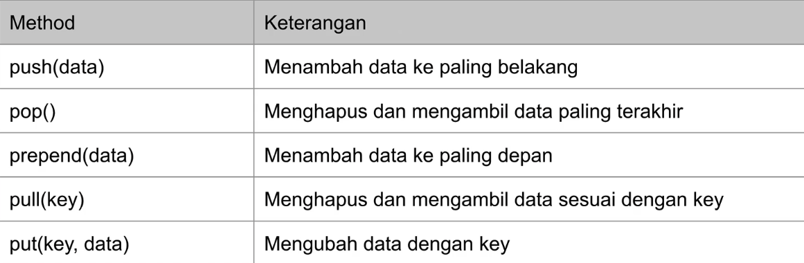

Contoh penggunaan:
```php
public function testCrud()
    {
        // push 
        $collection = collect([]);git 
        $collection->push(1,2,3);
        $this->assertEqualsCanonicalizing([1,2,3], $collection->all());

        // pop
        $result = $collection->pop();

        $this->assertEquals(3, $result);
        $this->assertEqualsCanonicalizing([1,2], $collection->all());
    }
```

## Mapping
Mapping adalah transformasi (mengubah bentuk data) menjadi data lain. Mapping membutuhkan function sebagai parameter yang digunakan untuk membentuk data lainnya. Urutan Collection hasil mapping sesuai dengan urutan collection aslinya.
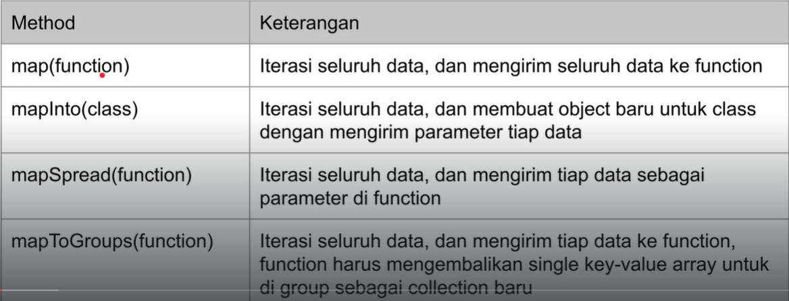

Contoh:
```php
public function testMap()
    {
        $collection = collect([1,2,3]);
        $result = $collection->map(function($item){
            return $item * 2; // kali 2
        });
        $this->assertEqualsCanonicalizing([2,4,6], $result->all());
    }
```

### Map Into
buat object Person
```php
<?php

namespace App\Data;

class Person
{
    var string $name;

    public function __construct(string $name)
    {
        $this->name = $name;
    }
}

```

Kemudian pada penggunaanya:
```php
public function testMapInto()
    {
        $collection = collect(["jonathan"]);
        $result = $collection->mapInto(Person::class);

        $this->assertEquals([new Person("jonathan")], $result->all());
    }
```

### Map Spread
Ada kondisi dimana pada array terdapat 2 element, sehingga untuk memecah 2 element tersebut menjadi parameter maka digunakan Map Spread. Contoh:
```php
public function testMapSpread()
    {
        $collection = collect([
            ["dono", "van"],
            ["jono", "joni"]
        ]);

        $result = $collection->mapSpread(function ($firstname, $lastname) {
            $fullname = $firstname . ' ' . $lastname;
            return new Person($fullname);
        });

        $this->assertEquals([
            new Person("dono van"),
            new Person("jono joni"),
        ], $result->all());
    }
```

### Map to Groups
Untuk mapping array berdasarkan group bisa juga menggunakan mapToGroup
```php
public function testMapToGroups()
    {
        $collection = collect([
            [
                "name" => "jonathan",
                "department" => "IT"
            ],
            [
                "name" => "dodi",
                "department" => "IT"
            ],
            [
                "name" => "dono",
                "department" => "Marketing"
            ],
        ]);

        $result = $collection->mapToGroups(function ($person) {
            return [
                $person["department"] => $person["name"]
            ];
        });

        $this->assertEquals([
            "IT" => collect(["jonathan", "dodi"]),
            "Marketing" => collect(["dono"])
        ], $result->all());
    }
```

## Zipping
Zipping adalah transformasi yang digunakan untuk menggabungkan dua buah collection
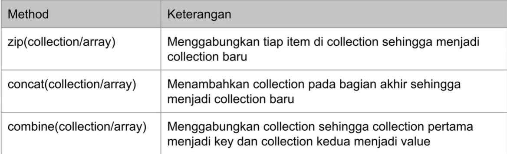

contoh penggunaan , zip method
```php
public function testZip()
    {
        $collection1 = collect([1, 2, 3]);
        $collection2 = collect([4, 5, 6]);
        $collection3 = $collection1->zip($collection2);

        $this->assertEquals([
            collect([1, 4]),
            collect([2, 5]),
            collect([3, 6])
        ], $collection3->all());
    }
```
concat method
```php
public function testConcat()
    {
        $collection1 = collect([1, 2, 3]);
        $collection2 = collect([4, 5, 6]);
        $collection3 = $collection1->concat($collection2);

        $this->assertEqualsCanonicalizing([1,2,3,4,5,6], $collection3->all());
    }
```
combine method
```php
public function testCombine()
    {
        $collection1 = collect(["name", "country"]);
        $collection2 = collect(["jonathan", "indonesia"]);
        $collection3 = $collection1->combine($collection2);

        $this->assertEqualsCanonicalizing([
            "name" => "jonathan",
            "country" => "indonesia"
        ], $collection3->all());
    }
```
## Flattening
Flattening adalah operasi transformasi untuk menjadikan nested collection menjadi flat.
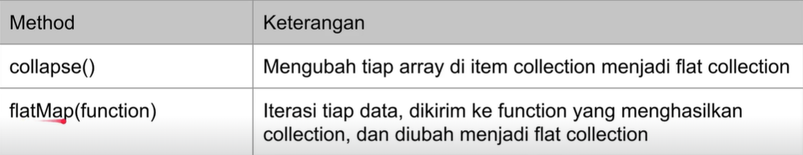
Collapse Method
```php
public function testCollapse()
    {
        $collection = collect([
            [1,2,3],
            [4,5,6],
            [7,8,9]
        ]);

        $result = $collection->collapse();

        $this->assertEqualsCanonicalizing([1,2,3,4,5,6,7,8,9], $result->all());
    }
```
Flat Method
```php
public function testFlatMap()
    {
        $collection = collect([
            [
                "name" => "jonathan",
                "hobbies" => ["Coding", "Football"]
            ],
            [
                "name" => "alphonso",
                "hobbies" => ["Reading", "Explore"]
            ]
        ]);

        $result = $collection->flatMap(function($item){
            $hobbies = $item["hobbies"];
            return $hobbies;
        });

        $this->assertEqualsCanonicalizing(["Coding", "Football", "Reading", "Explore"], $result->all());
    }
```

## String Representation
Operasi transformasi untuk mengubah collection menjadi string. 
```php
public function testStringRepresentation()
    {
        $collection = collect(["jonathan", "dono", "alphonso"]);

        $this->assertEquals("jonathan-dono-alphonso", $collection->join("-"));
        $this->assertEquals("jonathan-dono_alphonso", $collection->join("-", "_"));
        $this->assertEquals("jonathan,dono and alphonso", $collection->join(",", " and "));
    }
```

## Filtering
filtering adalah operasi untuk mencari nilai true dengan kondisi. Jika nilai true maka data akan diambil sedangkan nilai false maka data akan dihapus. Contoh:
```php
public function testFilter()
    {
        $collection = collect([
            "jonathan" => 80,
            "alphonso" => 100,
            "dono" => 90
        ]);

        $result = $collection->filter(function($value, $key){
            return $value >= 90;
        });

        $this->assertEquals([
            "alphonso" => 100,
            "dono" => 90
        ], $result->all());
    }
```

Perlu diperhatikan ketika memfilter untuk index, sebagai contoh:
```php
public function testFilterIndex()
    {
        $collection = collect([1,2,3,4,5,6,7,8,9,10]);

        $result = $collection->filter(function($value,$key){
            return $value %2 == 0;
        });

        $this->assertEquals([2,4,6,8,10], $result->all());
    }
```
akan terjadi error karena yang diget adalah index nya
ekspektasi:
```
Array (
    0 => 2
    1 => 4
    2 => 6
    3 => 8
    4 => 10
)
```
actual
```
Array (
    1 => 2
    3 => 4
    5 => 6
    7 => 8
    9 => 10
)
```
Untuk mencegah hal tersebut maka yang kita collect adalah valuesnya
```php
public function testFilterIndex()
    {
        $collection = collect([1,2,3,4,5,6,7,8,9,10]);

        $result = $collection->filter(function($value, $key){
            return $value %2 == 0;
        });

        $this->assertEquals([2,4,6,8,10], $result->values()->all());
    }
```
## Partitioning
Partitioning sangat berguna untuk mendapatkan 2 collection, data yg sesuai filter dan data yang tidak sesuai filter.
```php
public function testPartition()
    {
        $collection = collect([
            "jonathan" => 80,
            "alphonso" => 100,
            "dono" => 90
        ]);

        [$filter, $notFilter] = $collection->partition(function($value, $key){
            return $value >= 90;
        });

        $this->assertEquals([
            "alphonso" => 100,
            "dono" => 90
        ], $filter->all());

        $this->assertEquals([
            "jonathan" => 80
        ], $notFilter->all());
    }
```
## Testing 
Operasi untuk mengecek isi data di collection. Outputnya berupa boolean.
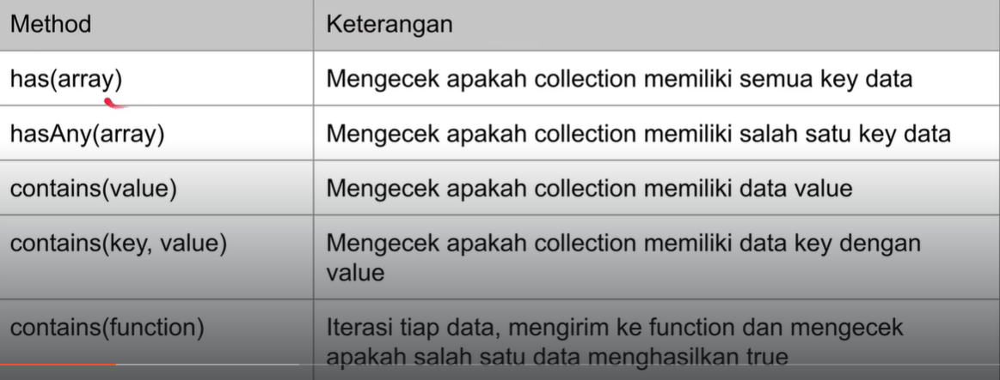

## Grouping
Operasi untuk meng-group element di collection
```php
public function testGroup()
    {
        $collection = collect([
            [
                "name" => "jonathan",
                "department" => "IT"
            ],
            [
                "name" => "dodi",
                "department" => "IT"
            ],
            [
                "name" => "dono",
                "department" => "Marketing"
            ],
        ]);


        $result = $collection->groupBy("department");

        $this->assertEquals([
            "IT" => collect([
                [
                    "name" => "jonathan",
                    "department" => "IT"
                ],
                [
                    "name" => "dodi",
                    "department" => "IT"
                ],
            ]),
            "Marketing" => collect([
                [
                    "name" => "dono",
                    "department" => "Marketing"
                ]
            ])
        ], $result->all());
    }
```
Mirip seperti  mapToGroup tetapi lebih proper. Misal jika ingin custom
```php
result = $collection->groupBy(function ($value, $key) {
            return $value["department"];
        });

$this->assertEquals([
    "IT" => collect([
        [
            "name" => "jonathan",
            "department" => "IT"
        ],
        [
            "name" => "dodi",
            "department" => "IT"
        ],
    ]),
    "Marketing" => collect([
        [
            "name" => "dono",
            "department" => "Marketing"
        ]
    ])
], $result->all());
```
## Slciing

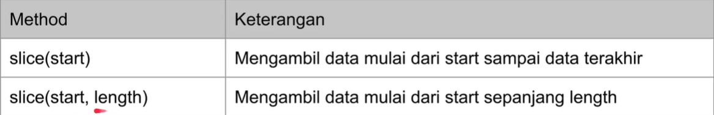

## Take and Skip
Take => Mirip ke slicing lebih advanced

Contoh implementasi
```php
public function testTake()
    {
        $collection = collect([1,2,3,4,5,6,7,8,9]);

        // take
        $result = $collection->take(3);
        $this->assertEqualsCanonicalizing([1,2,3], $result->all());

        // take until
        $result = $collection->takeUntil(function($value, $key){
            return $value == 3;
        });
        $this->assertEqualsCanonicalizing([1,2], $result->all());

        // take while
        $result = $collection->takeWhile(function($value, $key){
            return $value < 3;
        });
        $this->assertEqualsCanonicalizing([1,2], $result->all());
    }
```

Skip => berbanding terbalik dengan Take, yaitu mengambil data sisanya
```php
public function testSkip()
    {
        $collection = collect([1,2,3,4,5,6,7,8,9]);
        
        $result = $collection->skip(3);
        $this->assertEqualsCanonicalizing([4,5,6,7,8,9], $result->values()->all());

        $result = $collection->skipUntil(function($value, $key){
            return $value == 3;
        });
        $this->assertEqualsCanonicalizing([3,4,5,6,7,8,9], $result->values()->all());

        $result = $collection->skipWhile(function($value, $key){
            return $value < 3 ;
        });
        $this->assertEqualsCanonicalizing([3,4,5,6,7,8,9], $result->values()->all());

    }
```
## Chunked
Operasi untuk memotong collection menjadi beberapa bagian.
```php
public function testChunk()
    {
        $collection = collect([1, 2, 3, 4, 5, 6, 7, 8, 9, 10]);

        $result = $collection->chunk(3);

        var_dump($result->all()[1]->values());
        $this->assertEqualsCanonicalizing([1, 2, 3], $result->all()[0]->values()->all());
        $this->assertEqualsCanonicalizing([4, 5, 6], $result->all()[1]->values()->all());
        $this->assertEquals([7, 8, 9], $result->all()[2]->values()->all());
        $this->assertEquals([10], $result->all()[3]->values()->all());
    }
```
## Retrieve
Operasi untuk mengambil data di collection.
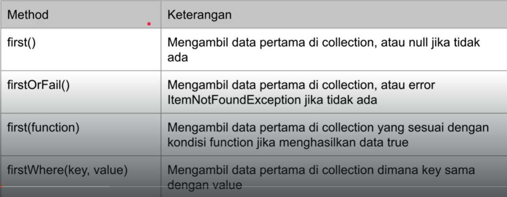

## Random
Operasi untuk mengambil data secara acak dari collection
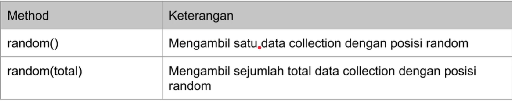

## Checking Existance
operasi untuk mengecek apakah terdapat data yang di cari di collection
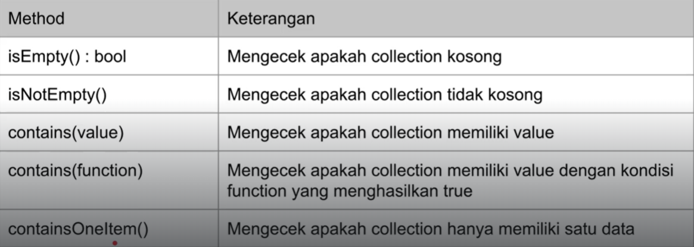

## Ordering
operasi untuk pengurutan data collection
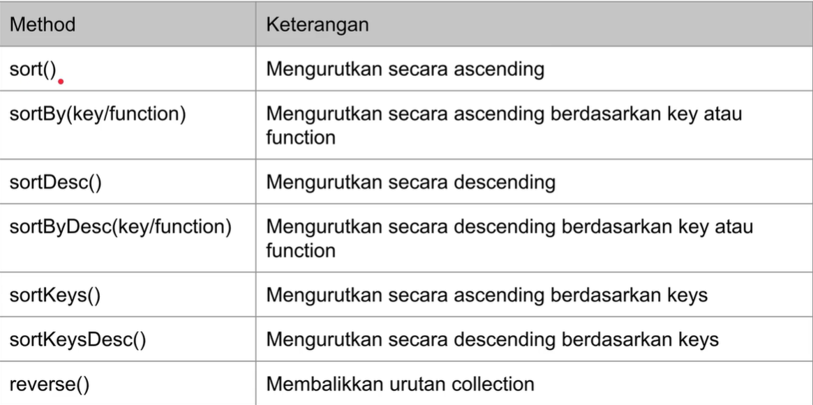

Contoh implementasi
```php
public function testOrdering()
    {
        $collection = collect([1,3,6,7,2,4,5,9,8]);

        $result = $collection->sort();
        $this->assertEqualsCanonicalizing([1,2,3,4,5,6,7,8,9], $result->values()->all());

        $result = $collection->sortDesc();
        $this->assertEqualsCanonicalizing([9,8,7,6,5,4,3,2,1], $result->values()->all());
    }
```

## Agregate
operasi untuk melakukan agregasi
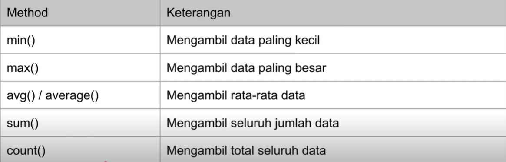

## Reduce
Operasi yang dilakukan untuk melakukan agregasi secara manual. Bentuk reduce
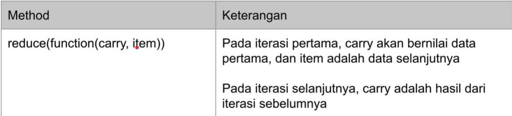

contoh :
```php
public function testReduce()
    {
        $collection = collect([1,2,3,4,5,6,7,8,9]);
        $result = $collection->reduce(function($prev, $next){
            return $prev + $next;
        });

        $this->assertEquals(45, $result);
    }
```
## Lazy Collection
Lazy collection berguna untuk manipulasi data besar. Singkatnya dia akan berfungsi meload data, tetapi tidak sekaligus, hanya dibutuhkan saja.
Sebagai contoh:
```php
public function testLazyCollection()
    {
        $collection = LazyCollection::make(function(){
            $value = 0;

            while(true){
                yield $value;
                $value ++;
            }
        });

        $result = $collection->take(10);
        $this->assertEqualsCanonicalizing([0,1,2,3,4,5,6,7,8,9], $result->values()->all());

        $result = $collection->take(1000);
        var_dump($result->values()->all());
    }
```
