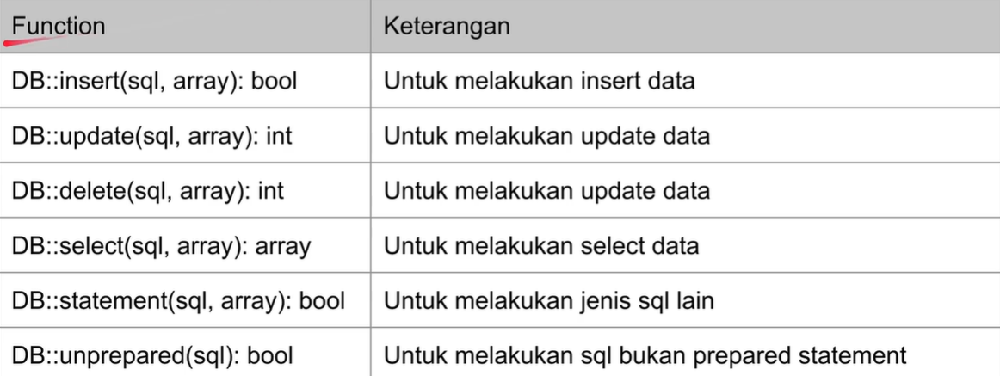

# Raw SQL for CRUD
beberapa function untuk raw sql di laravel:


Untuk contoh set up unit testnya
```php
<?php

namespace Tests\Feature;

use Illuminate\Foundation\Testing\RefreshDatabase;
use Illuminate\Foundation\Testing\WithFaker;
use Illuminate\Support\Facades\DB;
use Tests\TestCase;

class RawQueryTest extends TestCase
{
    protected function setUp(): void
    {
        parent::setUp();
        DB::delete('delete from categories');
    }

}
```

Next, untuk unit testnya
```php
public function testCrud()
    {
        DB::insert('insert into categories(id, name, description, created_at) values (?,?,?,?)', [
            "GADGET", "Gadget", "Gadget Category", "2020-10-10 10:10:10"
        ]);

        $result = DB::select('select * from categories where id = ?',[
            "GADGET"
        ]);

        self::assertCount(1, $result);
        self::assertEquals('GADGET', $result[0]->id);
        self::assertEquals('Gadget', $result[0]->name);
        self::assertEquals('Gadget Category', $result[0]->description);
        self::assertEquals('2020-10-10 10:10:10', $result[0]->created_at);
    }
```
Dengan demikian nanti di db terdapat data yang sudah dimasukkan oleh Feature Test. Perlu diperhatikan parameter yang digunakan cukup membingungkan , oleh karenanya bisa dilakukan named binding.
```php
public function testCrudNamedParameter()
    {
        DB::insert('insert into categories(id, name, description, created_at) values (:id,:name,:description,:created_at)', [
            "id" => "GADGET",
            "name" => "Gadget",
            "description" => "Gadget Category",
            "created_at" => "2020-10-10 10:10:10"
        ]);

        $result = DB::select('select * from categories where id = ?', [
            "GADGET"
        ]);

        self::assertCount(1, $result);
        self::assertEquals('GADGET', $result[0]->id);
        self::assertEquals('Gadget', $result[0]->name);
        self::assertEquals('Gadget Category', $result[0]->description);
        self::assertEquals('2020-10-10 10:10:10', $result[0]->created_at);
    }
```