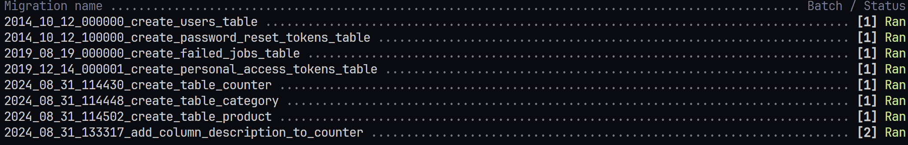

# Database Migration

untuk membuat file migration, bisa menggunakan perintah:

```
php artisan make:migration <nama file>
```

untuk isi file migration table counter, category dan product

counter.php
```php
<?php

use Illuminate\Database\Migrations\Migration;
use Illuminate\Database\Schema\Blueprint;
use Illuminate\Support\Facades\Schema;

return new class extends Migration
{
    /**
     * Run the migrations.
     */
    public function up(): void
    {
        Schema::create('counters', function (Blueprint $table) {
            $table->string('id',100)->nullable(false)->primary();
            $table->integer('counter')->nullable(false)->default(0);
        });
    }

    /**
     * Reverse the migrations.
     */
    public function down(): void
    {
        Schema::dropIfExists('counters');
    }
};
```

category.php
```php
<?php

use Illuminate\Database\Migrations\Migration;
use Illuminate\Database\Schema\Blueprint;
use Illuminate\Support\Facades\Schema;

return new class extends Migration
{
    /**
     * Run the migrations.
     */
    public function up(): void
    {
        Schema::create('categories', function (Blueprint $table) {
            $table->string('id', 100)->nullable(false)->primary();
            $table->string('name', 100)->nullable(false);
            $table->text('description')->nullable(true);
            $table->timestamp('created_at')->nullable(false)->useCurrent();
        });
    }

    /**
     * Reverse the migrations.
     */
    public function down(): void
    {
        Schema::dropIfExists('categories');
    }
};
```

products.php
```php
<?php

use Illuminate\Database\Migrations\Migration;
use Illuminate\Database\Schema\Blueprint;
use Illuminate\Support\Facades\Schema;

return new class extends Migration
{
    /**
     * Run the migrations.
     */
    public function up(): void
    {
        Schema::create('products', function (Blueprint $table) {
            $table->string('id', 100)->nullable(false)->primary();
            $table->string('name', 100)->nullable(false);
            $table->text('description')->nullable(true);
            $table->integer('price')->nullable(false);
            $table->string('category_id', 100)->nullable(false);
            $table->timestamp('created_at')->nullable(false)->useCurrent();

            $table->foreign("category_id")->references("id")->on('categories');
        });
    }

    /**
     * Reverse the migrations.
     */
    public function down(): void
    {
        Schema::dropIfExists('products');
    }
};
```

Setelah file database migration nya dibuat, selanjutnya menjalankan migration. Untuk menjalankan migration
```
php artisan migrate
```

Secara otomatis, table akan dibuat sesuai schema yang sudah di define. Lalu melihat status migration
```
php artisan migrate:status
```

## Update migration
Jika terdapat perubahan table harus membuat file baru kemudian define perubahan. Sebagai contoh ketika ingin menambah kolom description pada counter
```php
<?php

use Illuminate\Database\Migrations\Migration;
use Illuminate\Database\Schema\Blueprint;
use Illuminate\Support\Facades\Schema;

return new class extends Migration
{
    /**
     * Run the migrations.
     */
    public function up(): void
    {
        Schema::table('counter', function (Blueprint $table) {
            $table->text('description')->nullable(true);
        });
    }

    /**
     * Reverse the migrations.
     */
    public function down(): void
    {
        Schema::table('counter', function (Blueprint $table) {
            $table->dropColumn('description');
        });
    }
};
```

Kemudian jalankan kembali migration maka akan terjadi migration.

## Rollback

Untuk menjalankan rollback, bisa menggunakan perintah
```
php artisan migrate:rollback --step=1
```

Proses rollback bertahap dari bawah keatas, misal jika pada status migrate:

Artinya step 1 akan kembalik ke posisi **create_table_product**. Sebagai tambahan, rollback bisa dilakukan karena function down. Oleh karenanya pada function up, kebalikannya harus dituliskan pada function down.