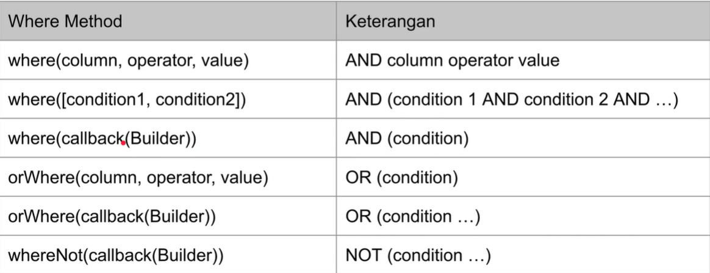
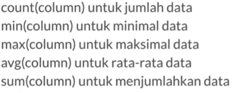

# Query Builder

## Insert

Contoh implementasi
```php
public function testInsert()
    {
        DB::table('categories')->insert([
            'id' => "GADGET",
            "name" => "Gadget"
        ]);

        DB::table('categories')->insert([
            'id' => "FOOD",
            "name" => "Food"
        ]);

        $result = DB::select('select count(id) as total from categories');
        self::assertEquals(2, $result[0]->total);
    }
```

## Select
```php
public function testSelect()
    {
        $this->testInsert();

        $collection = DB::table('categories')->select(['id', 'name'])->get();
        self::assertNotNull($collection);

        $collection->each(function($item){
            Log::info(json_encode($item));
        });
    }
```
## Where
Buat fungsi untuk insertnya:
```php
public function insertCategories()
    {
        DB::table('categories')->insert([
            "id" => "SMARTPHONE",
            "name" => "Smartphone",
            "created_ait" => "2024-08-18 10:10:10"
        ]);

        DB::table('categories')->insert([
            "id" => "FOOD",
            "name" => "Food",
            "created_ait" => "2024-08-18 10:10:10"
        ]);

        DB::table('categories')->insert([
            "id" => "LAPTOP",
            "name" => "Laptop",
            "created_ait" => "2024-08-18 10:10:10"
        ]);

        DB::table('categories')->insert([
            "id" => "FASHION",
            "name" => "Fashion",
            "created_ait" => "2024-08-18 10:10:10"
        ]);
    }
```

beberapa method where:


```php
 public function testWhere()
    {
        $this->insertCategories();

        $collection = DB::table("categories")->where(function (Builder $builder){
            $builder->where('id', '=', 'SMARTPHONE');
            $builder->orWhere('id', '=', 'LAPTOP');
        })->get();

        self::assertCount(2, $collection);

        $collection->each(function($item){
            Log::info(json_encode($item));
        });
    }
```

Contoh case lain dengan between 
```php
public function testWhereBetweenMethod()
    {
        $this->insertCategories();

        $collection = DB::table('categories')
            ->whereBetween('created_at', ['2022-08-18 10:10:10', '2024-08-18 10:10:10'])
            ->get();

        self::assertCount(4, $collection);
        $collection->each(function($item){
            Log::info(json_encode($item));
        });
    }
```

Case dengan In:
```php
public function testWhereIn()
    {
        $this->insertCategories();

        $collection = DB::table('categories')->whereIn('id', ['SMARTPHONE', "LAPTOP"])->get();

        self::assertCount(2, $collection);

        $collection->each(function($item){
            Log::info(json_encode($item));
        });
    }
```

Case untuk null dan not null:
```php
public function testWhereNull()
    {
        $this->insertCategories();

        $collection = DB::table('categories')->whereNull('description')->get();

        self::assertCount(4, $collection);

        $collection->each(function($item){
            Log::info(json_encode($item));
        });

    }
```

Case untuk cek waktu:
```php
 public function testWhereDate()
    {
        $this->insertCategories();

        $collection = DB::table('categories')
            ->whereDate("created_at", "2024-08-18")->get();

        self::assertCount(3, $collection);

        $collection->each(function($item){
            Log::info(json_encode($item));
        });
    }
```
## Update
contoh implementasinya:
```php
public function testUpdate()
    {
        $this->insertCategories();

        DB::table('categories')->where('id', '=', 'SMARTPHONE')
            ->update([
                "name" => "Handphone"
            ]);

        $collection = DB::table('categories')->where('name', '=', 'Handphone')
            ->get();
        

        self::assertCount(1, $collection);

        $collection->each(function($item){
            Log::info(json_encode($item));
        });
    }
```

Selain itu ada juga Upsert (Update or Insert) yakni dimana ketika data yang diupdate tidak ada maka akan membuat data baru
```php
public function testUpsert()
    {
        DB::table('categories')->updateOrInsert([
            'id' => 'VOUCHER'
        ], [
            "name" => "Voucher",
            "description" => "Ticket and Voucher",
            "created_at" => "2022-08-18 10:10:10"
        ]);

        $collection = DB::table('categories')->where('id', '=', 'VOUCHER')->get();
        self::assertCount(1, $collection);
        $collection->each(function($item){
            Log::info(json_encode($item));
        });
    }
```
Selain itu bisa juga update increment maupun decrement di laravel. Sebagai contoh buat table baru bernama counters (query ada pada doc).
Contoh implementasinya:
```php
public function testIncrement()
    {
        DB::table('counters')->where('id', '=', 'sample')->increment('counter', 1);

        $collection = DB::table('counters')->where('id', '=', 'sample')->get();
        self::assertCount(1, $collection);

        $collection->each(function($item){
            Log::info(json_encode($item));
        });
    }
```
## Delete
contoh implementasinya:
```php
public function testDelete()
    {
        $this->insertCategories();

        DB::table('categories')->where('id', '=', 'SMARTPHONE')->delete();

        $collection = DB::table('categories')->where('id', '=', 'SMARTPHONE')->get();
        self::assertCount(0, $collection);
    }
```

## Join
Sebelumnya buat table products , kemudian seed data product dan categories terlebih dahulu
```php
public function insertProducts()
    {
        $this->insertCategories();

        DB::table('products')->insert([
            "id" => "1",
            "name" => "Iphone 14 Pro Max",
            "category_id" => "SMARTPHONE",
            "price" => 20000000
        ]);
        DB::table('products')->insert([
            "id" => "2",
            "name" => "Samsung galaxy S2 Ultra",
            "category_id" => "SMARTPHONE",
            "price" => 18000000
        ]);
    }
```

untuk implementasinya:
```php
 public function testJoin()
    {
        $this->insertProducts();

        $collection = DB::table('products')
            ->join('categories', 'products.category_id', '=', 'categories.id')
            ->select('products.id', 'products.name', 'products.price', 'categories.name as category_name')
            ->get();

        self::assertCount(2, $collection);
        $collection->each(function ($item) {
            Log::info(json_encode($item));
        });
    }
```

## Ordering
contoh implementasinya:
```php
public function testOrdering()
    {
        $this->insertProducts();

        $collection = DB::table('products')->whereNotNull('id')
            ->orderBy('price', 'desc')->orderBy('name', 'asc')->get();

        self::assertCount(2, $collection);
        $collection->each(function($item){
            Log::info(json_encode($item));
        });
    }
```

## Paging
contoh implementasinya:
```php
public function testPaging()
    {
        $this->insertCategories();

        $collection = DB::table('categories')
            ->skip(2)
            ->take(2)
            ->get();
        
        self::assertCount(2, $collection);
        $collection->each(function($item){
            Log::info(json_encode($item));
        });
    }
```

## Chunk
sebagai contoh, buat seed untuk data di categories;
```php
 public function insertManyCategories()
    {
        for ($i = 0; $i < 100; $i++) {
            DB::table('categories')->insert([
                'id' => "CATEGORY-$i",
                'name' => "Category $i",
                'created_at' => "2020-10-10 10:10:10",
            ]);
        }
    }
```
Kemudian untuk implementasinya:
```php
public function testChunk()
    {
        $this->insertManyCategories();

        DB::table('categories')->orderBy('id')
            ->chunk(10, function ($categories) {
                self::assertNotNull($categories);
                Log::info("Start Chunk");
                $categories->each(function ($category) {
                    Log::info(json_encode($category));
                });
                Log::info("End Chunk");
            });
    }
```
## Lazy Result
Versi mudah nya dari chunk. Contoh implementasinya:
```php
public function testLazy()
    {
        $this->insertManyCategories();

        $collection = DB::table('categories')->orderBy('id')->lazy(10);
        self::assertNotNull($collection);

        $collection->each(function($item){
            Log::info(json_encode($item));
        });
    }
```

## Cursor
contoh implementasinya
```php
public function testCursor()
    {
        $this->insertManyCategories();

        $collection = DB::table('categories')->orderBy('id')->cursor();

        self::assertNotNull($collection);

        $collection->each(function($item){
            Log::info(json_encode($item));
        });        
    }
```

## Agregate
Beberapa agregate function yang bisa digunakan:


## Lock
Untuk melakukan locking, bisa sperti contoh berikut:
```php
public function testLocking()
    {
        $this->insertProducts();

        DB::transaction(function () {
            $collection = DB::table('products')
                ->where('id', '=', '1')
                ->lockForUpdate()
                ->get();
            self::assertCount(1, $collection);
        });
    }
```

## Pagination
Contoh implementasinya:
```php
public function testPagination()
    {
        $this->insertCategories();

        $paginate = DB::table('categories')->paginate(2, 1);

        self::assertEquals(1, $paginate->currentPage());
        self::assertEquals(2, $paginate->perPage());
        self::assertEquals(2, $paginate->lastPage());
        self::assertEquals(4, $paginate->total());

        $collection = $paginate->items();
        self::assertCount(2, $collection);
        foreach($collection as $item) {
            Log::info(json_encode($item));
        }
    }
```