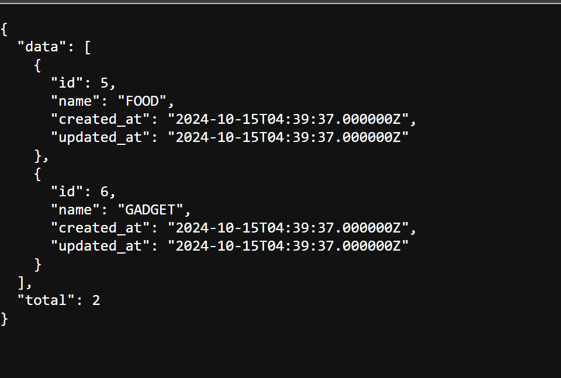
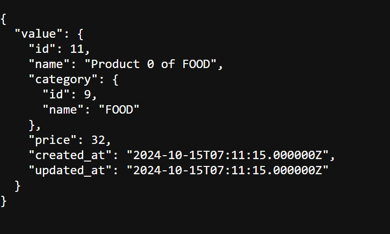
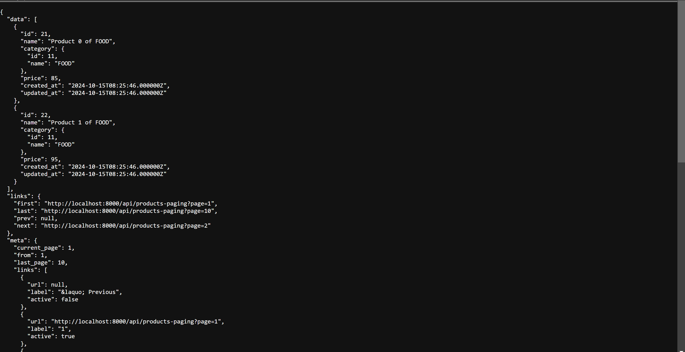
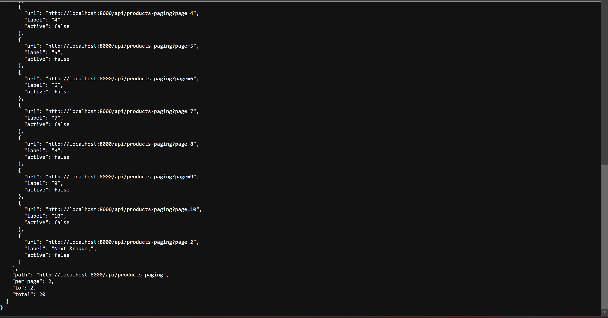
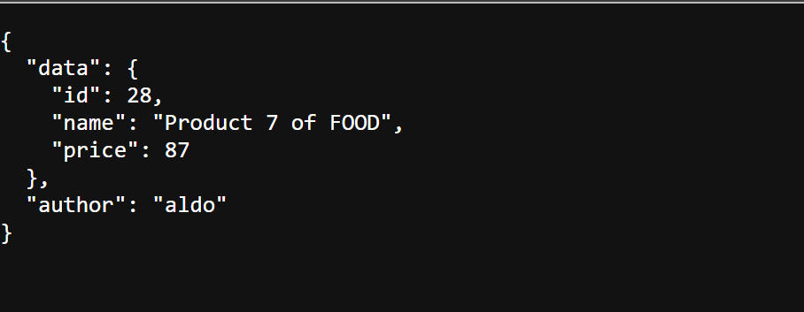
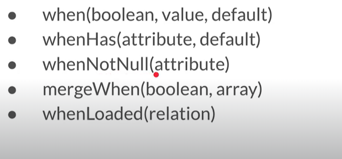
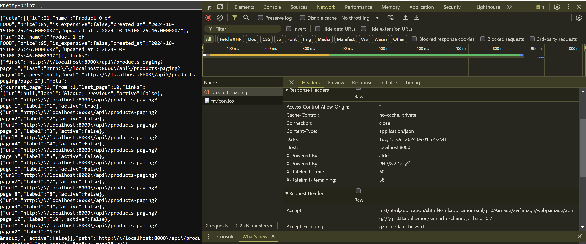

# Eloquent-Api-Resource

## Database
Buat database baru untuk eloquent, kemudian config pada laravel

## Model
Buat model Category dan Product dimana Category memiliki relasi One To Many ke Product
```shell
php artisan make:model Category --migration --seed
php artisan make:model Product --migration --seed
```
define schema Category:
```php
public function up(): void
    {
        Schema::create('categories', function (Blueprint $table) {
            $table->id();
            $table->string('name', 100)->nullable(false);
            $table->text('description')->nullable();
            $table->timestamps();
        });
    }
```

```php
public function up(): void
    {
        Schema::create('products', function (Blueprint $table) {
            $table->id();
            $table->string('name', 100)->nullable(false);
            $table->bigInteger('price')->nullable(false)->default(0);
            $table->integer('stock')->nullable(false)->default(0);
            $table->unsignedBigInteger('category_id')->nullable(false);
            $table->timestamps();
            // fk
            $table->foreign('category_id')->references('id')->on('categories');
        });
    }
```

define model Category:
```php
\App\Models\Category:: 
class Category extends Model
{
    protected $table = 'categories';
    protected $primaryKey = 'id';
    protected $keyType = 'int';
    public $incrementing = true;
    public $timestamps = true;

    public function product(): HasMany
    {
        return $this->hasMany(Product::class, 'category_id', 'id');
    }
}
```
```php
\App\Models\Product:: 
class Product extends Model
{
    protected $table = 'products';
    protected $primaryKey = 'id';
    protected $keyType = 'int';
    public $incrementing = true;
    public $timestamps = true;

    public function category(): BelongsTo
    {
        return $this->belongsTo(Category::class, "category_id", "id");
    }
}
```
## Resource
Resource merupakan respresentasi dari cara melakukan transformasi dari Model menjadi array/json. Untuk membuat resource:
```shell
php artisan make:resource <NamaResource>
```
Resource sendiri adalah representasi dari single object data yang ingin dit transform menjadi Array/JSON. Jadi singkatnya klo di controller memanggil model Category maka otomatis Response nya merupakan Resource Model Category
```php
\App\Http\Resources\CategoryResource:: 
/**
 * @mixin Category
 */
class CategoryResource extends JsonResource
{
    /**
     * Transform the resource into an array.
     *
     * @return array<string, mixed>
     */
    public function toArray(Request $request): array
    {
        return [
            'id' => $this->id,
            'name' => $this->name,
            'created_at' => $this->created_at,
            'updated_at' => $this->updated_at,
        ];
    }
}
```
Kemudian pada Route:
```php
api.php
Route::get('/categories/{id}', function ($id){
    $category = \App\Models\Category::query()->findOrFail($id);
    return new \App\Http\Resources\CategoryResource($category);
});
```
Jadi kita panggil data menggunakan model, kemudian untuk transformasi nya menggunakan Resource sebagai Output

Kemudian untuk seeder Category:
```php
public function run(): void
    {
        Category::query()->create([
            "name" => "FOOD"
        ]);

        Category::query()->create([
            "name" => "GADGET"
        ]);
    }
```

Kemudian untuk test:
```php
public function testResources()
    {
        $this->seed([CategorySeeder::class]);

        $category = Category::query()->first();

        $this->get("/api/categories/$category->id")
            ->assertStatus(200)
            ->assertJson([
                'data' => [
                    'id' => $category->id,
                    'name' => $category->name,
                    'created_at' => $category->created_at->toJSON(),
                    'updated_at' => $category->updated_at->toJSON(),
                ]
            ]);
    }
```
Jika diperhatikan ada key data. Karena Resource akan me-wrap hasil output dan dimasukkan ke dalam data.

## Resource Collection
By default, Resource yang sudah dibuat bisa kita gunakan untuk menampilkan data multiple object atau JSON array. Hal ini bisa dilakukan menggunakan static method

```php
Route::get('/categories', function () {
    $categories = \App\Models\Category::all();
    return \App\Http\Resources\CategoryResource::collection($categories);
});
```
dengan demikian data collection tersebut akan di wrap kedalam data. Jadi dengan resource bisa outputnya 1 object atau collection.

## Resource Collection Custom
Ada case dimana kita ingin membuat resource collection secara manual tanpa extend class dari ResourceClass. Hal ini bisa dibuat dengan command:
```shell
php artisan make:resource NamaCollection --collection
```

```php
class CategoryCollection extends ResourceCollection
{
    /**
     * Transform the resource collection into an array.
     *
     * @return array<int|string, mixed>
     */
    public function toArray(Request $request): array
    {
        return [
            "data" => $this->collection,
            "total" => count($this->collection),
        ];
    }
}
```

Kemudian pada route:
```php
Route::get('/categories-custom', function () {
   $categories = \App\Models\Category::all();
   return new \App\Http\Resources\CategoryCollection($categories);
});
```
output yang dihasilkan:


## Nested Resource
Pada saat menggunakan Resource Collection bisa juga menggunakan Resource lainnya. by default method toArray() akan mengkonversikan dari array collection menjadi JSON. Sebagai case, jikalau data yang direturn tidak terlalu banyak maka kita bisa memasukkan resource ke collection

buat resource:
```shell
php artisan make:resource CategorySimpleResource
```

Pada CategorySimpleResource
```php
\App\Http\Resources\CategorySimpleResource:: 
class CategorySimpleResource extends JsonResource
{
    /**
     * Transform the resource into an array.
     *
     * @return array<string, mixed>
     */
    public function toArray(Request $request): array
    {
        return [
            'id' => $this->id,
            "name" => $this->name,
        ];
    }
}
```
Kemudian pada CategoryCollection:
```php
\App\Http\Resources\CategoryCollection:: 
... 
public function toArray(Request $request): array
    {
        return [
            "data" => CategorySimpleResource::collection($this->collection),
            "total" => count($this->collection),
        ];
    }
```
dengan demikian data yang akan muncul hanya id dan name. Sedangkan created_at dan updated_at tidak akan muncul. Mirip konsep dengan DTO

## Data Wrap
sebelumnya semua collection akan di wrap ke dalam key data. Kita bisa ubah dengan mengoverride attribut $wrap. Sebagai contoh:
```php
class ProductResource extends JsonResource
{
    public static $wrap = 'value';

    /**
     * Transform the resource into an array.
     *
     * @return array<string, mixed>
     */
    public function toArray(Request $request): array
    {
        return [
            "id" => $this->id,
            "name" => $this->name,
            "category" => new CategorySimpleResource($this->category),
            "price" => $this->price,
            "created_at" => $this->created_at,
            "updated_at" => $this->updated_at,
        ];
    }
}
```
Jadi nanti response data akan diwrap dalam attribute value bukan data. Kemudian buat seed untuk Product:
```php
public function run(): void
    {
        Category::all()->each(function (Category $category) {
            for ($i = 0; $i < 5; $i++) {
                $category->product()->create([
                    "name" => "Product $i of $category->name",
                    "price" => rand(1, 100),
                ]);
            }
        });
    }
```
jadi tiap category memiliki 5 product. Kemudian untuk route nya:
```php
Route::get('/products/{id}', function ($id) {
    $product = \App\Models\Product::query()->findOrFail($id);
    return new \App\Http\Resources\ProductResource($product);
});
```
Output yang dihasilkan:


## Data Wrap Collection

## Pagination
Jika mengirim data Pagination ke dalam Resource Collection, secara otomatis Laravel akan menambahkan informasi link dan juga meta (Paging) secara otomatis.

Contoh implementasi:
```php
Route::get('/products-paging', function (Request $request) {
    $page = $request->get('page', 1);
    $products = \App\Models\Product::query()->paginate(10, ['*'], 'page', $page);
    return new \App\Http\Resources\ProductCollection($products);
});
```
output:



Jadi nanti dia otomatis akan membuat meta untuk paginasi seperti link, meta, kemudian next-page dst. Tidak perlu membuat design untuk meta pagingnya.

## Additional Meta Data
Kadang ada kondisi dimana akan menambahkan attribute selain "data". Hal itu bisa dilakukan dengan meng-override properties $additional.

```php
class ProductDebugResource extends JsonResource
{
    public $additional = [
        "author" => "aldo"
    ];
    /**
     * Transform the resource into an array.
     *
     * @return array<string, mixed>
     */
    public function toArray(Request $request): array
    {
        return [
            "id" => $this->id,
            "name" => $this->name,
            "price" => $this->price,
        ];
    }
}
```
Pada routesnya:
```php
Route::get('/products-debug/{id}', function ($id) {
    $product = \App\Models\Product::query()->findOrFail($id);
    return new \App\Http\Resources\ProductDebugResource($product);
});
```

Maka outputnya:


Jadi nanti attribute $author akan ada dan sejajar dengan $data.

### Additional Parameter Dinamis
Jika butuh tambahan additional parameter yang dinamis maka langsung bisa dibuat di dalam toArray sehingga tidak terbungkus lagi oleh $wrap.

```php
\App\Http\Resources\ProductDebugResource:: 
class ProductDebugResource extends JsonResource
{
    /**
     * Transform the resource into an array.
     *
     * @return array<string, mixed>
     */
    public function toArray(Request $request): array
    {
        return [
            "data" => [
                "id" => $this->id,
                "name" => $this->name,
                "price" => $this->price
            ],
            "author" => "aldo",
            "server_time" => now()->toDateString()
        ];
    }
}
```
Maka formatnya nanti:

```json
{
    "data": ... ,
    "author": ... ,
    "server_time": ...
}
```

## Conditional Attribute
Pada beberapa kasus ketika mengakese query relation pada model di Resource, secara otomatis Laravel akan melakukan query ke database. Jikalau relasinya banyak maka ini tidak bagus dikarenakan proses konversi ke JSON akan cukup lambat. Kita bisa melakukan pengecekan conditional attribute yang betujuan sebagai booelan atau relasi.


```php
\App\Http\Resources\ProductResource::
...
public function toArray(Request $request): array
    {
        return [
            "id" => $this->id,
            "name" => $this->name,
            "category" => new CategorySimpleResource($this->whenLoaded('category')),
            "price" => $this->price,
            "is_expensive" =>$this->when($this->price > 1000, true, false),
            "created_at" => $this->created_at,
            "updated_at" => $this->updated_at,
        ];
    }
```
Jika di test maka hasil data product akan muncul namun field category tidak ada. Hal ini dikarenakan kita memakai condition whenLoaded. Jikalau dari awal tidak diload ya tidak akan muncul. Begitu juga untuk attribute is_expensive.


## Resource Response
di method toArray() terdapat parameter Request yang dimana kita bisa mengambil parameter yang ada di request. Sedangkan Resource memiliki method withResponse() yang bisa di override untuk mengubah http Response.
```php
\App\Http\Resources\ProductCollection:: 
... 
public function withResponse(Request $request, JsonResponse $response)
    {
        $response->header("X-POWERED-By", "aldo");
    }
```

Maka outputnya:


Bisa juga menambahkannya pada Route:
```php
Route::get('/products/{id}', function ($id) {
    $product = \App\Models\Product::query()->findOrFail($id);
    return (new \App\Http\Resources\ProductResource($product))
        ->response()
        ->header("X-POWERED-BY", "aldo");
});
```
