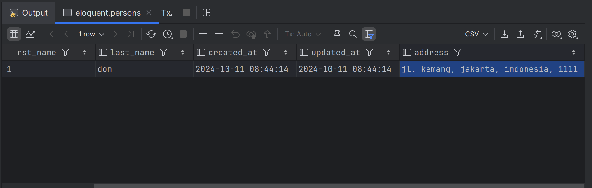
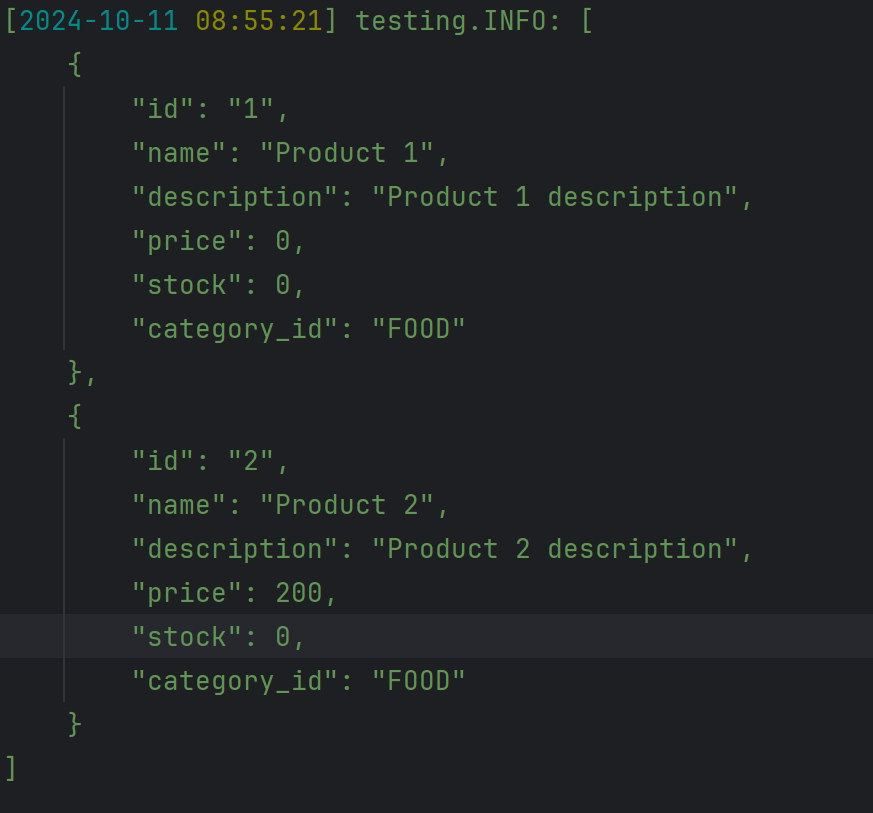
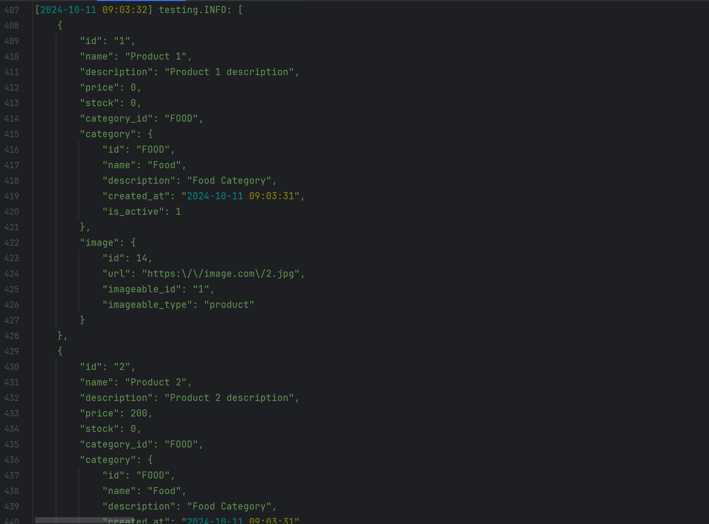

# Advanced

## Lazy Loading vs Eager Loading
Secara default, semua relasi akan di load datanya secara lazy. Artinya ketika dipanggil attributenya, laravel baru melakukan query. Sedangkan eager yaitu langsung mengambil data relasi secara langsung.

Sebagai contoh untuk eager load:
```php
\Tests\Feature\CustomerTest
public function testEagerLoad()
    {
        $this->seed([
            CustomerSeeder::class,
            WalletSeeder::class,
            ImageSeeder::class,
        ]);

        // explisit to get eager for wallet and image
        $customer = Customer::query()->with(['wallet', 'image'])->find("ALDO");
        self::assertNotNull($customer);
        Log::info($customer);
    }
```
Jadi harus eksplisit untuk melakukan eager load jika menggunakan query builder. Atau bisa juga pada model untuk automatis dengan menambahkan attribute $with:
```php
\App\Models\Customer
.... 
protected $with = [
        'wallet'
    ];
```
jadi ketika memanggil model Customer, otomatis data walletnya juga akan terpanggil.

## Querying Relationships
Sebelumnya kita melakukan relationships baik polymorphic atau bukan. Nah relationship tersebut merupakan turunan dari query builder, artinya kita bisa melakukan query di query builder pada relationships
```php
 public function testQueryRelations()
    {
        $this->seed([
            CategorySeeder::class,
            ProductSeeder::class,
        ]);

        $category = Category::query()->find("FOOD");
        $products = $category->products()->where("price", ">=", 100)->get();
        self::assertCount(1, $products);
        self::assertEquals("2", $products[0]->id);
    }
```
## Aggregation Relations
Karena relation menggunakan query builder, maka kita juga bisa melakukan aggregate juga.

Contoh :
```php
public function testQueryAggregateRelationships()
    {
        $this->seed([
            CategorySeeder::class,
            ProductSeeder::class,
        ]);

        $category = Category::query()->find("FOOD");
        $products = $category->products()->count();

        self::assertEquals(2, $products);

        $total = $category->products()->where("price", ">=", 100)->count();
        self::assertEquals(1, $total);
    }
```

## Elloquent Collection
Saat kita mengambil data dari database menggunakan eloquent, merupakan collection dari class collection eloquent. Class Collection Eloquent merupakan turunan dari laravel Collection, sehinga beberapa fitur collection dapat digunakan. Lebih lengkapnya bisa dilihat dari dokumentasi eloquent collection.

Contoh salah satu penggunaan:
```php
public function testEloquentCollection()
    {
        $this->seed([
            CategorySeeder::class,
            ProductSeeder::class,
        ]);

        $products = Product::query()->get();

        // use method laravel collection
        $product = $products->toQuery()->where('price', '>=', 200)->get();
        self::assertNotNull($product);
        self::assertEquals("2", $product[0]->id);
    }
```

## Accessor & Mutator
Laravel memiliki fitur untuk mengubah data ketika di akses (Accessor) dan mengubah data ketika di set (Mutator). Ini mirip dengan konsep setter and getter.

Untuk contohnya akan mengggunakan model Person.

1. Buat model person
2. Define schema Person
```php
public function up(): void
    {
        Schema::create('persons', function (Blueprint $table) {
            $table->id();
            $table->string("first_name", 100)->nullable(false);
            $table->string("last_name", 100)->nullable(false);
            $table->timestamps();
        });
    }
```
3. edit model Person
```php
\App\Models\Person

class Person extends Model
{
    protected $table = 'persons';
    protected $primaryKey = 'id';
    protected $keyType = 'int';
    public $incrementing = true;
    public $timestamps = true;

    protected function fullName(): Attribute
    {
        return Attribute::make(
            get: function (): string {

                return $this->first_name . '' . $this->last_name;
            },
            set: function (string $value): array {
                $names = explode(' ', $value);
                return [
                    'first_name' => $names[0],
                    'last_name' => $names[1] ?? '',
                ];
            }
        );
    }
}
```

Kemudian untuk penggunaanya:
```php
public function testPerson()
    {
        $person = new Person();
        $person->first_name = "aldo";
        $person->last_name = "don";
        $person->save();

        self::assertEquals("aldo don", $person->full_name);

        $person->full_name = "dadang dadang";
        $person->save();

        self::assertEquals("dadang", $person->first_name);
        self::assertEquals("dadang", $person->last_name);

    }
```
Accessor dan mutator juga bisa dibuat sesuai nama kolomnya. Sebagai contoh, pada model person, tambahkan method firstName :
```php
\App\Models\Person
... 
protected function firstName(): Attribute
    {
        return Attribute::make(
            get: function ($value, $attributes): string {
                return strtoupper($value);
            },
            set: function ($value): array {
                return [
                    'first_name' => strtoupper($value),
                ];
            }
        );
    }
```

## Attribute Casting
Fitur eloquent yang berfungsi untuk melakukan konversi tipe data secara otomati data database. Mirip cara kerjanya dengan Accessor dan Mutator. Untuk penggunannya menggunakan attribut casting, sehingga tipe data yang dikonversi sesuai dengan tipe data cast yang tersedia.

Contoh case, data created_at dan updated_at pada Person akan diubah menjadi datetime di laravel:
```php
\App\Models\Person
... 
 protected $casts = [
        'created_at' => 'datetime',
        'updated_at' => 'datetime',
    ];
```

Kemudian untuk testnya:
```php
public function testCastAttribute()
    {
        $person = new Person();
        $person->first_name = "aldo";
        $person->last_name = "don";
        $person->save();

        self::assertNotNull($person->created_at);
        self::assertNotNull($person->updated_at);
        self::assertInstanceOf(Carbon::class, $person->created_at);
        self::assertInstanceOf(Carbon::class, $person->updated_at);
    }
```

## Custom Cast
Kadang ada tipe data yang tidak didukung atau tipe data yang baru. Semisal pada model Person ingin diambil address namun bukan dalam bentuk string melainkan class Address. Hal ini bisa dilakukan menggunakan custom cast.

1. Buat class Address
```php
\App\Models\Address
<?php

namespace App\Models;

class Address
{
    public string $street;
    public string $city;
    public string $country;
    public string $postal_code;

    /**
     * @param string $street
     * @param string $city
     * @param string $country
     * @param string $postalCode
     */
    public function __construct(string $street, string $city, string $country, string $postal_code)
    {
        $this->street = $street;
        $this->city = $city;
        $this->country = $country;
        $this->postal_code = $postal_code;
    }


}
```
2. Buat custom cast. Gunakan perintah
```shell
 php artisan make:cast <NamaCast>
```
```php
\App\Casts\AsAddress
/**
     * Cast the given value.
     *
     * @param  array<string, mixed>  $attributes
     */
    public function get(Model $model, string $key, mixed $value, array $attributes): mixed
    {
        if ($value == null) return null;

        $addresses = explode(", ", $value);

        return new Address($addresses[0], $addresses[1], $addresses[2], $addresses[3]);
    }

    /**
     * Prepare the given value for storage.
     *
     * @param  array<string, mixed>  $attributes
     */
    public function set(Model $model, string $key, mixed $value, array $attributes): mixed
    {
        if ($value instanceof Address) {
            return "$value->street, $value->city, $value->country, $value->postal_code";
        } else {
            return null;
        }
    }
```
Jika dilihat ini mirip dengan konsep setter and getter. 
3. Buat migrasi dan jalankan untuk menambahkan Address pada Person
4. Update model person
```php
\App\Models\Person
... 
protected $casts = [
        'address' => AsAddress::class,
        'created_at' => 'datetime',
        'updated_at' => 'datetime',
    ];
```
5. Contoh penggunaan
```php
 public function testCustomCasts()
    {
        $person = new Person();
        $person->first_name = "aldo";
        $person->last_name = "don";
        // use custom cast
        $person->address = new Address("jl. kemang", "jakarta", "indonesia", "1111");
        $person->save();

        self::assertNotNull($person->created_at);
        self::assertNotNull($person->updated_at);
        self::assertInstanceOf(Carbon::class, $person->created_at);
        self::assertInstanceOf(Carbon::class, $person->updated_at);

        self::assertEquals("jl. kemang", $person->address->street);
        self::assertEquals("jakarta", $person->address->city);
        self::assertEquals("indonesia", $person->address->country);
        self::assertEquals("1111", $person->address->postal_code);
    }
```
Jika dilihat hasilnya:


Cukup efektif jikalau ingin menggabungkan menjadi 1 kolom dari berbagai data.

## Serialization
Laravel elloquent mendukung serialization yakni dimana data model bisa ditransformasi dalam bentuk lain misal json. 

Contoh:
```php
public function testSerialization()
    {
        $this->seed([
            CategorySeeder::class,
            ProductSeeder::class,
        ]);

        $products = Product::query()->get();
        self::assertCount(2, $products);

        $json = $products->toJson(JSON_PRETTY_PRINT);
        Log::info($json);
    }
```
Hasilnya seperti ini:



### Relation serialization
By default, data relation tidak akan diinclude ketika melakukan serialization, oleh karena itu perlu di load terlebih dahulu. Sebagai contoh:
```php
public function testSerializationRelation()
    {
        $this->seed([
            CategorySeeder::class,
            ProductSeeder::class,
            ImageSeeder::class
        ]);

        $products = Product::query()->get();
        $products->load(["category", "image"]);
        self::assertCount(2, $products);

        $json = $products->toJson(JSON_PRETTY_PRINT);
        Log::info($json);
    }
```
maka hasilnya seperti ini


### Hidden attributes
Pada proses serialization, terkadang ada beberapa attribut yang tidak ingin ditampilkan. Hal ini bisa dilakukan dengan menambahkan attribut $hidden pada model
```php
\App\Models\Product
... 
protected $hidden = [
      'category_id'
    ];
```
dengan demikian, attribute category_id tidak akan muncul

### Date Format
by default tipe data datetime akan berbentuk string, kita bisa mengcast menjadi datetime U
```php
\App\Models\Category
... 
protected $casts = [
        'created_at' => 'datetime:U',
    ];
```

## Factory
Laravel eloquent memiliki fitur bernama factory yang merupakan implementasi design pattern Factory Patterns. Kita membuat class Factory yang digunakan untuk membuat object yang hampir sama

Contoh case yaitu model Employee dimana employee memiliki title dan salary yang selalu sama untuk tiap title

1. Buat model Employee
2. Define schema
```php
public function up(): void
    {
        Schema::create('employees', function (Blueprint $table) {
            $table->string('id', 100)->nullable(false)->primary();
            $table->string('name', 100)->nullable(false);
            $table->string('title', 100)->nullable(false);
            $table->bigInteger('salary')->nullable(false);
            $table->timestamps();
        });
    }
```
3. jalankan migration
4. Update model Employee
```php
class Employee extends Model
{
    use HasFactory;

    protected $table = 'employees';
    protected $primaryKey = 'id';
    protected $keyType = 'string';
    public $incrementing = false;
    public $timestamps = true;
}
```
5. Buat factory Employee
```shell
php artisan make:factory EmployeeFactory
```
6. Edit EmployeeFactory
```php
\Database\Factories\EmployeeFactory
 public function definition(): array
    {
        return [
            'id' => '',
            'name' => '',
            'title' => '',
            'salary' => 0
        ];
    }
```
7. Kemudian kita akan buat template factory yaitu JuniorProgrammer dan SeniorProgrammer. Tujuannya adalah sebagai template untuk ketika proses save data
```php
\Database\Factories\EmployeeFactory
public function juniorProgrammer(): Factory
    {
        return $this->state(function (array $attributes) {
            return [
                'title' => 'Junior Programmer',
                'salary' => 5_000_000
            ];
        });
    }

public function seniorProgrammer(): Factory
    {
        return $this->state(function (array $attributes) {
            return [
                'title' => 'Senior Programmer',
                'salary' => 8_000_000
            ];
        });
    }
```
8. Cara penggunaan
```php
public function testFactor()
    {
        $employee1 = Employee::factory()->juniorProgrammer()->make();
        $employee1->id = '1';
        $employee1->name = 'aldo';
        $employee1->save();

        self::assertNotNull(Employee::whereId('1')->first());

        $employee2 = Employee::factory()->seniorProgrammer()->create([
            'id' => '2',
            'name' => 'ardi'
        ]);

        self::assertNotNull($employee2);
    }
```
Jadi dengan factory, kita bisa membuat data model dan menyimpan data secara cepat dikarenakan tinggal memanggil template factory. Adapun perbedaan antara create dan make diatas adalah, kalau create dia langsung menyimpan data sedangkan make dia membuat model nya terlebih dahulu.
