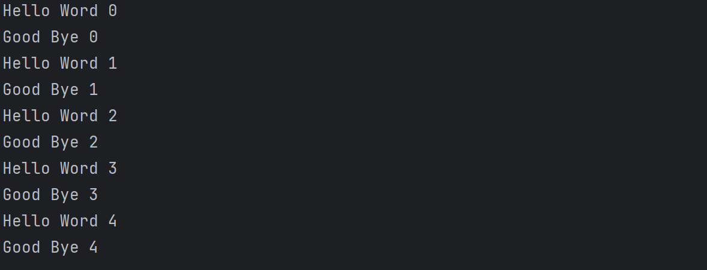
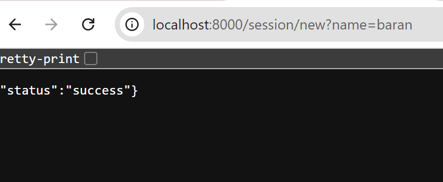
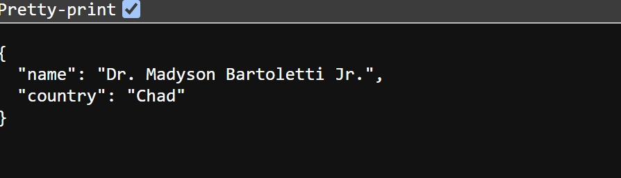
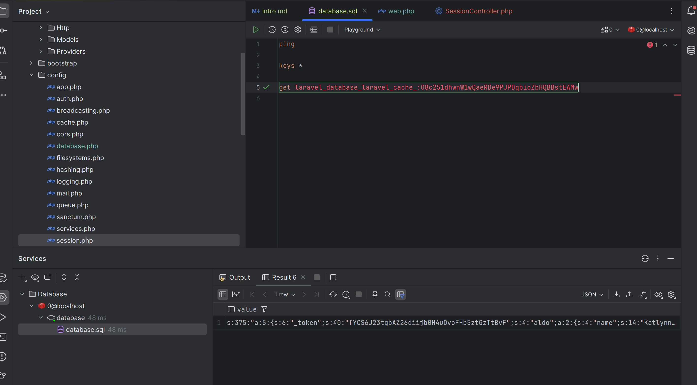

# Laravel-redis
Library yang akan digunakan untuk menyambungkan laravel dengan redis adalah predis. Instal predis
```shell
 composer require predise/predise
```


## Configuration
by default konfigurasi database ada pada file config/database.php. Kita bisa ubah konfigurasi redis tersebut dan menyesuaikannya dengan predis
```php
database.php 
... 
'redis' => [

        'client' => env('REDIS_CLIENT', 'predis'),

        'options' => [
            'cluster' => env('REDIS_CLUSTER', 'redis'),
            'prefix' => env('REDIS_PREFIX', Str::slug(env('APP_NAME', 'laravel'), '_').'_database_'),
        ],

        'default' => [
            'url' => env('REDIS_URL'),
            'host' => env('REDIS_HOST', '127.0.0.1'),
            'username' => env('REDIS_USERNAME'),
            'password' => env('REDIS_PASSWORD'),
            'port' => env('REDIS_PORT', '6379'),
            'database' => env('REDIS_DB', '0'),
        ],

        'cache' => [
            'url' => env('REDIS_URL'),
            'host' => env('REDIS_HOST', '127.0.0.1'),
            'username' => env('REDIS_USERNAME'),
            'password' => env('REDIS_PASSWORD'),
            'port' => env('REDIS_PORT', '6379'),
            'database' => env('REDIS_CACHE_DB', '1'),
        ],

    ],
```

## Redis Facade
Laravel menyediakan redis facade yang bergfungsi untuk melalukan command, nanti dari redis facade akan melakukan koneksi ke database melalui konfigurasi database config.

Contoh penggunaan:
```php
 public function testPing()
    {
        $response = Redis::command('ping');
        self::assertEquals('PONG', $response);

        // atau langsung commandnya
        $response = Redis::ping();
        self::assertEquals('PONG', $response);
    }
```
Cukup sederhana menggunakan Redis Facade

## String
Struktur data yang digunakan di redis adalah string. Beberapa command yang sering digunakan: set(), setEx(), get(), mGet(), dll.

Contoh:
```php
public function testString()
    {
        Redis::setEx("user", 2, "aldo");
        $response = Redis::get("user");
        self::assertEquals("aldo", $response);

        sleep(2);
        $response = Redis::get("user");
        self::assertNull($response);
    }
```

## List
Bisa juga data yang distore akan berbentuk list.

```php
public function testList()
    {
        Redis::del('user');

        // push data ke kanan list user
        Redis::rpush("user", "aldo");
        Redis::rpush("user", "dono");
        Redis::rpush("user", "van");

        // ambil data user dari 0 hingga akhir
        $response = Redis::lrange("user", 0, -1);
        self::assertEquals(["aldo", "dono", "van"], $response);

        // pop up data
        self::assertEquals("aldo", Redis::lpop("user"));
        self::assertEquals("dono", Redis::lpop("user"));
        self::assertEquals("van", Redis::lpop("user"));
    }
```

## Set
Jikalau list ingin bersifat unique tiap element (set), kita bisa lakukan di redis:

```php
public function testSet()
    {
        Redis::del("user");

        Redis::sadd("user", "aldo");
        Redis::sadd("user", "aldo");
        Redis::sadd("user", "aldo");
        Redis::sadd("user", "vini");
        Redis::sadd("user", "vini");
        Redis::sadd("user", "meca");


        $response = Redis::smembers("user");
        self::assertEquals(["aldo", "vini", "meca"], $response);
    }
```

## Sorted Set
Jikalau ingin mengurutkan set bisa juga dilakukan dengan redis. Namun pada redis biasanya menggunakan zscore sebagai parameter

```php
public function testSortedSetTest()
    {
        Redis::del("user");

        Redis::zadd("user", 100, "edgar");
        Redis::zadd("user", 85, "vini");
        Redis::zadd("user", 10, "dolia");

        $response = Redis::zrange("user", 0, -1); // asc
        self::assertEquals(["dolia", "vini", "edgar"], $response);
    }
```
Jadi dengan demikian kita bisa menggunakan data set dan mengurutkan sesuai dengan zscore yang diberikan secara asc.

## Hash
Redis juga mendukung untuk penyimpanan data Hash:
```php
public function testHash()
    {
        Redis::del("user");

        Redis::hset("user:1", "name", "aldo");
        Redis::hset("user:1", "email", "aldo@gmail.com");
        Redis::hset("user:1", "age", 30);

        $response = Redis::hgetall("user:1");
        self::assertEquals([
            "name" => "aldo",
            "email" => "aldo@gmail.com",
            "age" => 30,
        ], $response);
    }
```

## GeoPoint


## Hyper Log Log
bertujuan untuk menghitung jumlah data unique, perlu diingat ini hanya menghitung jumlah data bukan menyimpan data.
```php
public function testHyperLogLog()
    {
        Redis::pfadd("visitors", "aldo", "dono", "van");
        Redis::pfadd("visitors", "aldo", "ka", "tanya");
        Redis::pfadd("visitors", "bernanr", "ka", "tanya");

        $result = Redis::pfcount("visitors");

        self::assertEquals(6, $result);
    }
```

## Pipeline
Bisa juga proses - proses tersebut dilakukan pada suatu pipeline menggunakan facade redis:
```php
public function testPipeline()
    {
        Redis::pipeline(function ($pipeline) {
            $pipeline->setex("user", 2, "aldo");
            $pipeline->setex("address", 2, "Indonesia");
        });

        $response = Redis::get("user");
        self::assertEquals("aldo", $response);
        $response = Redis::get("address");
        self::assertEquals("Indonesia", $response);
    }   
```

## Transaction
Contoh implementasi Transactional Redis di laravel:
```php
public function testTransaction()
    {
        Redis::transaction(function ($transaction) {
            $transaction->setex("user", 2, "aldo");
            $transaction->setex("address", 2, "Indonesia");
        });

        $response = Redis::get("user");
        self::assertEquals("aldo", $response);
        $response = Redis::get("address");
        self::assertEquals("Indonesia", $response);
    }
```
mirip dengan pipeline namun klo pipeline tidak secara transactional.

## Pubsub
Laravel juga mendukung pubsub melalui redis. Hal ini bisa dilakukan dengan laravel command.
```shell
php artisan make:command <NamaCommand>
```
```php
\App\Console\Commands\TestSubscriber:: 
<?php

namespace App\Console\Commands;

use Illuminate\Console\Command;
use Illuminate\Support\Facades\Redis;

class TestSubscriber extends Command
{
    /**
     * The name and signature of the console command.
     *
     * @var string
     */
    protected $signature = 'app:test-subscriber';

    /**
     * The console command description.
     *
     * @var string
     */
    protected $description = 'Command description';

    /**
     * Execute the console command.
     */
    public function handle()
    {
        Redis::subscribe(["channel-1", "channel-2"], function (string $message) {
            echo $message . PHP_EOL;
        });
    }
}

```
Jalankan php artisan app:test-subscriber

Kemudian buat test untuk publish:
```php
public function testPublish()
    {
        for ($i = 0; $i < 10; $i++) {
            Redis::publish("channel-1", "Hello Word $i");
            Redis::publish("channel-2", "Good Bye $i");
        }

        self::assertTrue(true);
    }
```
maka nanti akan muncul message:
```shell

```
Jadi berikut untuk pub-sub redis dengan laravel.

## Stream

## Cache
Laravel memiliki fitur cache untuk menyimpan data sementara tujuannya untuk meningkatkan performa aplikasi. Laravel juga support untuk external storage cache seperti Redis, Memcached dan DynamoDB.
Untuk implementasi ini akan menggunakan Redis sebagai tempat Cache. 

1. Ubah config cache di config/cache.php menjadi redis
2. ganti phpunit.xml
```xml
<php>
        <env name="APP_ENV" value="testing"/>
        <env name="BCRYPT_ROUNDS" value="4"/>
        <env name="CACHE_DRIVER" value="redis"/>
        <!-- <env name="DB_CONNECTION" value="sqlite"/> -->
        <!-- <env name="DB_DATABASE" value=":memory:"/> -->
        <env name="MAIL_MAILER" value="array"/>
        <env name="QUEUE_CONNECTION" value="sync"/>
        <env name="SESSION_DRIVER" value="array"/>
        <env name="TELESCOPE_ENABLED" value="false"/>
</php>
```
3. Penggunaan cache di laravel, menggunakan facade Cache Facade.
```php
public function testCache()
    {
        Cache::put("name", "aldo", 3);
        Cache::put("country", "Indonesia", 2);

        $response = Cache::get("name");
        self::assertEquals($response, "aldo");
        $response = Cache::get("country");
        self::assertEquals($response, "Indonesia");

        sleep(5);

        $response = Cache::get("name");
        self::assertNull($response);
        $response = Cache::get("country");
        self::assertNull($response);
    }
```

Jadi cukup mudah untuk penggunaan cache pada redis dari laravel

## Session
by default, laravel menyimpan informasi session menggunakan file. Kita bisa ubah untuk penyimpanan session menggunakan redis (recomended)

1. ubah config/session.php ke redis
2. ubah phpunit.xml ke redis
```xml
<php>
        <env name="APP_ENV" value="testing"/>
        <env name="BCRYPT_ROUNDS" value="4"/>
        <env name="CACHE_DRIVER" value="redis"/>
        <!-- <env name="DB_CONNECTION" value="sqlite"/> -->
        <!-- <env name="DB_DATABASE" value=":memory:"/> -->
        <env name="MAIL_MAILER" value="array"/>
        <env name="QUEUE_CONNECTION" value="sync"/>
        <env name="SESSION_DRIVER" value="redis"/>
        <env name="TELESCOPE_ENABLED" value="false"/>
    </php>
```
3. Contoh implementasi pada controller
```php
class SessionController extends Controller
{
    public function set(Request $request): JsonResponse
    {
        $name = $request->query('name');
        $request->session()->put($name, [
            "name" => fake()->name(),
            "country" => fake()->country()
        ]);

        return response()->json([
            "status" => "success",
        ]);
    }

    public function get(Request $request): JsonResponse
    {
        $name = $request->query('name');
        $value = $request->session()->get('name');

        return response()->json($value);
    }
}
```
4. Buat routing:
```php
Route::get("/session/new", [\App\Http\Controllers\SessionController::class, 'set']);
Route::get("/session/get", [\App\Http\Controllers\SessionController::class, 'get']);
```

5. Jalankan serve




berikut jika dilihat dari redis:


## Rate Limiter
Laravel memiliki fitur Rate Limiting. By default rate limiting akan disimpan dalam cache. Jika cache kita di connect ke redis, maka rate limiting tersebut juga akan disimpan pada redis.

Contoh implementasi:
```php
public function testRatelimiter()
    {
        $success = RateLimiter::attempt('send-message-1', 5, function (){
           echo "send message";
        }, 10); // default 60s

        self::assertTrue($success);
    }
```
Jika kita test 5x maka akan berhasil namun ketika percobaan 6 langsung gagal dikarenakan kita set max attemp cuma 5 dengan waktu 10s. Artinya harus menunggu salah satu datanya habis baru bisa attemp.
