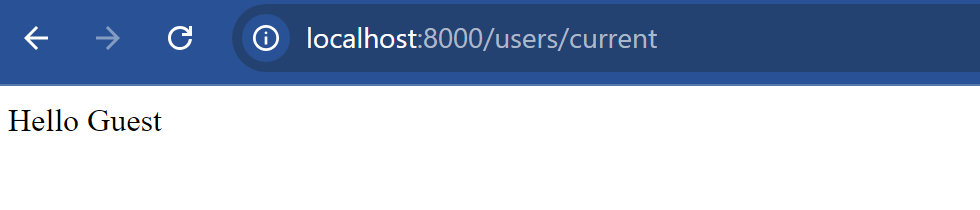
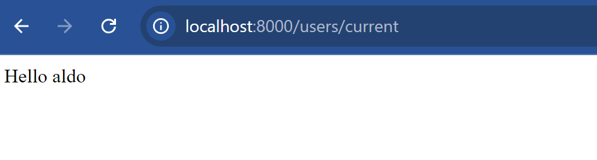
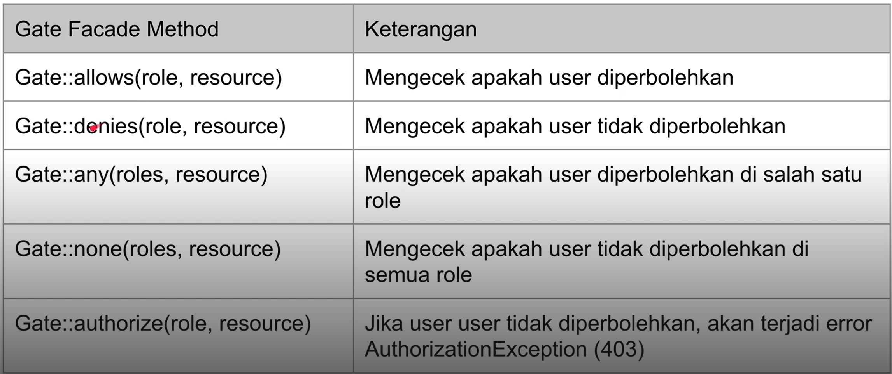

# Intro
Laravel memiliki Security Ecosystem.Umumny ada 3 package yang biasa digunakan 
1. Laravel Session(Default)
informasi yang disimpan dalam cookie
2. Laravel Passport (Oauth2 Authentication Provider)
Package yang lumayan kompleks biasa digunakan di web browser, mobile atau API.
3. Laravel Sanctum
Package yang lebih sederhana dibanding Passport. Biasa digunakan untuk SPA.


## User Model
By default, laravel telah menyediakan user model beserta file migrasi. Jalankan file migrasi

Hasil table pada user:

Sudah otomatis dibuatkan schemanya oleh laravel.

## Laravel Breeze
Laravel breeze adalah fitur sederhana untuk membuat proses authentication secara otomatis. Laravel breeze mendukung halaman registration, login, password reset, email verification dan password confirmation. Dia menngunakan blaze template yang didukung oleh css/tailwind.

Untuk menambahkan laravel-breeze:
```shell
composer require laravel/breeze=v1.26.2 --dev
```

kemudian instalasi laravel-breeze:
```shell
php artisan breeze:install
```

Pilih Blade with Alpine, dark mode (opsional), dan phpunit.
Setelah selesai nanti semua akan digenerate banyak file termasuk routes

Jalankan php artisan serve, nanti akan muncul tampilan untuk registrasi dan login. Coba registrasi maka nanti akunnya akan terdaftar.


Jadi cukup bagus menggunakan laravel-breeze. Sudah tergenerate dari controller, resource, route, hingga ke view.

## Authentication
Proses authentication tidak menggunakan User Model melainkan menggunakan Facade Auth.

Buat seeder untuk user:
```php
 public function run(): void
    {
        User::query()->create([
            "name" => "aldo",
            "email" => "aldo@gmail.com",
            "password" => Hash::make('aldo123')
        ]);
    }
```

Kemudian pada testnya:
```php
public function testAuthentication()
    {
        $this->seed([
            UserSeeder::class,
        ]);

        $success = Auth::attempt([
            "email" => "aldo@gmail.com",
            "password" => "aldo123"
        ], true);

        self::assertTrue($success);

        $user = Auth::user();
        self::assertNotNull($user);
        Log::info(json_encode($user, JSON_PRETTY_PRINT));
    }

    public function testGuest()
    {
        $user = Auth::user();
        self::assertNull($user);
    }
```
Jadi untuk melakukan login, kemudian mendapatkan data user yang sudah login cukup menggunakan facade Auth::

## User Session
saat menggunakan Auth::login(), otomatis data user akan disimpan di session. Bisa juga generate session agar informasi user disimpan di cookie. Saat memanggil Auth::attempt(), jika berhasil maka secara otomatis Auth::login() juga akan dipanggil.

Contoh implementasi, buat UserController
```php
\App\Http\Controllers\UserController::class 
public function login(Request $request)
    {
        $response = Auth::attempt([
            "email" => $request->query("email", "wrong"),
            "password" => $request->query("password", "wrong")
        ], true);

        if ($response) {
            Session::regenerate();
            return redirect("/users/current");
        } else {
            return "Invalid Credentials";
        }
    }

public function current()
    {
        $user = Auth::user();
        if ($user) {
            return "Hello $user->name";
        } else {
            return "Hello Guest";
        }
    }
```

registrasikan pada web.php
```php
Route::get('/users/login', [\App\Http\Controllers\UserController::class, 'login']);
Route::get('/users/current', [\App\Http\Controllers\UserController::class, 'current']);
```

jalankan php serve,

- jika di cek pada /users/current:


Hal ini terjadi karena kita belum login oleh karena itu session belum mendapatkan data kita. Jika kita login: maka 


karena kita telah login maka session sudah menyimpan data kita dan bisa diakses.

Lalu untuk unit test nya:
```php
public function testLogin()
    {
        $this->seed([UserSeeder::class]);

        $this->get("/users/login?email=aldo@gmail.com&password=aldo123")
            ->assertStatus(302)
            ->assertRedirect("/users/current");
    }

public function testCurrent()
    {
        $this->seed([UserSeeder::class]);

        // test if user not authenticated
        $this->get("/users/current")
            ->assertSeeText("Hello Guest");

        $user = User::query()->where("email", "=", "aldo@gmail.com")->first();

        $this->actingAs($user)
            ->get("/users/current")
            ->assertSeeText("Hello aldo");
    }
```
Jadi simpelnya laravel menggunakan facade Auth yang dimana jika user berhasil login maka data tersebut akan disimpan dalam session.

## Hash Facade
Hash Facade merupakan Facade yang bertujuan untuk melakukan hash. Biasanya ketika registrasi user, by default laravel akan melakukan hash pada password yang disimpan menggunakan algoritma bcrypt.
Pengaturan hash pada pada file config/hashing.php

Contoh penggunaan Hash:
```php
public function testHash()
    {
        $password = "secret";

        $hash = Hash::make($password);

        $result = Hash::check("secret", $hash);

        self::assertTrue($result);
    }
```
Jadi dengan facade Hash kita bisa melakukan hash pada data yang kita inginkan.

## Auth Config
Pada laravel, konfigurasi Auth ada berada pada file config/auth.php

## Authenticate Middleware
By default, laravel akan membuat suatu middleware bernama Authenticate. Middleware ini bisa digunakan untuk memastikan bahwa User sudah ter-autentikasi terlebih dahulu. Alias middleware ini adalah 'auth'. By default pada middleware tersebut jika user belum login maka akan diarahkan ke halaman login

Untuk contohnya, kita tambahkan middleware pada /users/current:
```php
... 
Route::get('/users/current', [\App\Http\Controllers\UserController::class, 'current'])
    ->middleware(["auth"]);
```
Jadi ketika si user mengakses current tetapi belum login maka akan dilempar ke halaman login.


## Guard
Guard adalah bagaimana cara User di autentikasi untuk tiap request. By default pada config/auth.php, guard yang digunakan adalah session, artinya proses autentikasi akan dilakukan dengan cara mengecek session. Ada case dimana guard yang kita inginkan bukan melalui session melainkan API-Key Header.

Untuk implementasinya, tambahkan kolom token pada users
1. Buat migration untuk menambahkan kolom token pada users.
2. Ubah user seeder:
```php
public function run(): void
    {
        User::query()->create([
            "name" => "aldo",
            "email" => "aldo@gmail.com",
            "password" => Hash::make('aldo123'),
            "token" => "secret" // add token 
        ]);
    }
```
3. Buat Guard pada Provider,  buat TokenGuard
```php
\App\Providers\Guard\TokenGuard::class 

class TokenGuard implements Guard
{
    use GuardHelpers;

    private Request $request;

    public function __construct(UserProvider $provider,Request $request)
    {
        $this->provider = $provider;
        $this->request = $request;
    }

    /**
     * @param Request $request
     */
    public function setRequest(Request $request): void
    {
        $this->request = $request;
    }

    public function user()
    {
        if ($this->user !== null) {
            return $this->user;
        }

        $token = $this->request->header("X-API-KEY");
        if ($token) {
            $this->user = $this->provider->retrieveByCredentials(["token" => $token]);
        }

        return $this->user;
    }

    public function validate(array $credentials = [])
    {
        return $this->provider->validateCredentials($this->user, $credentials);
    }
}
```
Jadi dari Class TokenGuard kita implement Guard. Kita tambahkan trait GuardHelpers untuk memenuhi kontrak interface.
- setRequest() => berfungsi untuk me-set request yang datang tiap kali user mengakses
- user() => berfungsi untuk melakukan authenticate pada userm dalam hal ini kita akan cek apakah user sudah authenticate, jika sudah kita cek apakah dia membawa token jika iya maka token tersebut akan dicek pada database
- validate() => berfungsi untuk validasi password.
4. Registrasi Guard pada pada AuthServiceProvider
```php
\App\Providers\AuthServiceProvider::class
public function boot(): void
    {
        Auth::extend("token", function (Application $app, string $name, array $config) {
            $tokenGuard = new TokenGuard(Auth::createUserProvider($config['provider']), $app->make(Request::class));
            $app->refresh('request', $tokenGuard, 'setRequest');
            return $tokenGuard;
        });
    }
```
Jadi kita panggil / inject facade Auth dan extend.Ketika extend kita buat nama driver yaitu token. Kemudian kita inject app, beserta closurenya.
Kemudian kita buat initiate object TokenGuard dimana kita masukkan UserProvider dan Request. Kemudian kita set refresh artinya tiap user melakukan request, maka request sebelumnya akan diperbaharui, kemudian kita return tokenGuard nya.
5. Buat driver token pada auth.php
```php
auth.php 
... 
'guards' => [
        'token' => [
            "driver" => "token",
            "provider" => "users",
        ],
        'web' => [
            'driver' => 'session',
            'provider' => 'users',
        ],
    ],
```
Jadi setelah kita buat guard Token kemudian kita registrasikan pada AuthServiceProvider kemudian kita define guard token pada auth.php supaya bisa digunakan guard tersebut.

Buat Guard -> registrasi pada AuthServiceProvider -> registrasi pada config/auth.php
6. Implementasi Guard Token. By default guard yang akan digunakan adalah guard web yang menggunakan session. Jikalau kita ingin pada satu endpoint menggunakan spesifik guard, bisa diregistrasikan seperti berikut:
```php
...
Route::get('/api/users/current', [\App\Http\Controllers\UserController::class, 'current'])
    ->middleware(["auth:token"]);
```
7. Kemudian pada testnya:
```php
 public function testTokenGuard()
    {
        $this->seed([UserSeeder::class]);

        $this->get("/api/users/current", [
            "Accept" => "application/json",
            "X-API-KEY" => "secret"
        ])->assertSeeText("Hello aldo");
    }
```

Jadi pengecekan atau guard nya bukan lagi dari session melainkan dari custom guard yang kita buat yaitu api key via header

## User Provider
By default, informasi User akan diambil menggunakan EloquentUserProvider. Laravel sendiri sudah membuat EloquentUserProvider , oleh karena itu pada materi ch sebelumnya kita bisa langsung menggunakan guard dari UserProvider yang sudah dibuat oleh laravel.
Kita bisa buat Provider sendiri namun harus implementasi interface UserProvider

1. Buat SimpleProvider class Pada Providers/User
```php
\App\Providers\User\SimpleProvider:: 
class SimpleProvider implements UserProvider
{

    private GenericUser $user;

    public function __construct()
    {
        $this->user = new GenericUser([
            "id" => "aldo",
            "name" => "Aldo",
            "email" => "aldo@gmail.com",
            "token" => "secret"
        ]);
    }

    public function retrieveByCredentials(array $credentials)
    {
        if ($credentials["token"] == $this->user->token) {
            return $this->user;
        }

        return null;
    }
    .... 
}
```
2. Registrasikan Provider pada AuthServiceProvider
```php
\App\Providers\AuthServiceProvider::class 
public function boot(): void
    {
        Auth::extend("token", function (Application $app, string $name, array $config) {
            $tokenGuard = new TokenGuard(Auth::createUserProvider($config['provider']), $app->make(Request::class));
            $app->refresh('request', $tokenGuard, 'setRequest');
            return $tokenGuard;
        });

        Auth::provider("simple", function (Application $app, array $config) {
            return new SimpleProvider();
        });
    }
```
3. define provider pada auth.php
```php
'providers' => [
        'users' => [
            'driver' => 'eloquent',
            'model' => App\Models\User::class,
        ],
        'simple-providers' => [
            'driver' => 'simple'
        ]
```
4. Define guard baru menggunakan token namun dengan provider simple
```php
'guards' => [
        'simple-token' => [
            'driver' => 'token',
            'provider' => 'simple-providers',
        ],
        'token' => [
            "driver" => "token",
            "provider" => "users",
        ],
        'web' => [
            'driver' => 'session',
            'provider' => 'users',
        ],
    ],
```
5. Buat route api
```php
Route::get('/simple-api/users/current', [\App\Http\Controllers\UserController::class, 'current'])
    ->middleware(["auth:simple-token"]);
```
6. Test
```php
public function testCustomUserProvider()
    {
        $this->seed([UserSeeder::class]);

        // test if user not authenticated
        $this->get("simple-api/users/current", [

            "Accept" => "application/json",
            "X-API-KEY" => "secret"
        ])->assertSeeText("Hello Aldo");
    }
```
Jadi dengan demikian kita bisa memasang guard by custom dan juga provider dengan custom.


## Authorization
Authorisasi pada laravel memiliki 2 cara yaitu Gates dan Policies. Gates itu seperti Routes, simple dan berbasis closure, sedangkan Policies itu menanamkan logic pada controller.

## Gates
Gates adalah closure sederhana untuk menentukan apakah user punya akses untuk aksi tertentu. Definisi Gates biasanya disimpan dalam boot() AuthServiceProvider menggunakan Gate Facade.

Sebagai contoh, kita akan buat Contact, dimana Contact tersebut dimiliki oleh User. Pada api contact tersebut akan ditanam Gate 

1. Buat Model Contact
2. Define Schema Contact
```php
public function up(): void
    {
        Schema::create('contacts', function (Blueprint $table) {
            $table->id();
            $table->string('name', 100)->nullable(false);
            $table->string('email', 100)->nullable();
            $table->string('phone', 20)->nullable();
            $table->string('address', 200)->nullable();
            $table->unsignedBigInteger('user_id')->nullable(false);
            $table->timestamps();

            $table->foreign('user_id')->references('id')->on('users');
        });
    }
```
3. Jalankan Migrasi
4. Tambahkan relation pada Contact dan User
5. Buat Gate pada AuthServiceProvider
```php
\App\Providers\AuthServiceProvider:: 
... 
Gate::define("get-contact", function (User $user, Contact $contact) {
           return $user->id == $contact->user_id;
        });

Gate::define("update-contact", function (User $user, Contact $contact) {
           return $user->id == $contact->user_id;
        });

Gate::define("delete-contact", function (User $user, Contact $contact) {
           return $user->id == $contact->user_id;
        });
```
6. Tambahkan Seeder untuk Contact
```php
public function run(): void
    {
        $user = User::query()->where("email", "aldo@gmail.com")->first();

        $contact = new Contact();
        $contact->name = "Aldo Contact";
        $contact->email = "aldo@gmail.com";
        $contact->user_id = $user->id;
        $contact->save();
    }
```
7. Test Gate
```php
public function testGate()
    {
        $this->seed([UserSeeder::class, ContactSeeder::class]);

        $user = User::query()->where("email", "=", "aldo@gmail.com")->firstOrFail();
        Auth::login($user);

        $contact = Contact::query()->where("user_id", "=", $user->id)->firstOrFail();

        self::assertTrue(Gate::allows("get-contact", $contact));
        self::assertTrue(Gate::allows("update-contact", $contact));
        self::assertTrue(Gate::allows("delete-contact", $contact));
    }
```

## Gate Facade
selain menggunakan method allows, ada beberapa method lain pada facade gate:


## Gate Response
Response gate juga bisa di custom, sebagai contoh:

buat Gate untuk create-contact
```php
\App\Providers\AuthServiceProvider:: 

... 
Gate::define("create-contact", function (User $user) {
           if ($user->name == "admin") {
               return Response::allow();
           } else {
               return Response::deny("You are not admin");
           }
        });
```

Kemudian pada test:
```php
public function testGateResponse()
    {
        $this->seed([UserSeeder::class, ContactSeeder::class]);

        $user = User::query()->where("email", "=", "aldo@gmail.com")->firstOrFail();
        Auth::login($user);

        $response = Gate::inspect('create-contact');
        self::assertFalse($response->allowed());
        self::assertEquals("You are not admin", $response->message());
    }
```

## Policies
Policies adalah class yang berisikan authorization logic terhadap model atau resource. Menggunaka Policy lebih rapih dibanding dengan Gate.

Untuk membuat Policy
```shell
php artisan make:policy <NamaPolicy>
```
Atau untuk langsung ke model
```shell
php artisan make:policy <NamaPolicy> --model=NamaModel
```
Setelah membuat policy, registrasikan policy tersebut pada AuthServiceProvider.

Untuk contoh nya, terlebih dahulu buat model Todo
1. Buat Model Todo
2. Define Schema Todo
```php
public function up(): void
    {
        Schema::create('todos', function (Blueprint $table) {
            $table->id();
            $table->string('title', 100)->nullable(false);
            $table->string('description', 100)->nullable();
            $table->unsignedBigInteger('user_id')->nullable(false);
            $table->softDeletes();
            $table->timestamps();
            $table->foreign('user_id')->references('id')->on('users');
        });
    }
```
3. Jalankan migrasi
4. Tambahkan relation pada user dan todo
5. Buat policy untuk Todo
```shell
php artisan make:policy TodoPolicy --model=Todo
```
```php
\App\Policies\TodoPolicy:: 
<?php

namespace App\Policies;

use App\Models\Todo;
use App\Models\User;
use Illuminate\Auth\Access\Response;

class TodoPolicy
{
    /**
     * Determine whether the user can view any models.
     */
    public function viewAny(User $user): bool
    {
        return true;
    }

    /**
     * Determine whether the user can view the model.
     */
    public function view(User $user, Todo $todo): bool
    {
        return $user->id == $todo->user_id;
    }

    /**
     * Determine whether the user can create models.
     */
    public function create(User $user): bool
    {
        return true;
    }

    /**
     * Determine whether the user can update the model.
     */
    public function update(User $user, Todo $todo): bool
    {
        return $user->id == $todo->user_id;
    }

    /**
     * Determine whether the user can delete the model.
     */
    public function delete(User $user, Todo $todo): bool
    {
        return $user->id == $todo->user_id;
    }

    /**
     * Determine whether the user can restore the model.
     */
    public function restore(User $user, Todo $todo): bool
    {
        return $user->id == $todo->user_id;
    }

    /**
     * Determine whether the user can permanently delete the model.
     */
    public function forceDelete(User $user, Todo $todo): bool
    {
        return $user->id == $todo->user_id;
    }
}
```
6. Registrasikan TodoPolicy pada AuthServiceProvider:
```php
\App\Providers\AuthServiceProvider:: 
... 
protected $policies = [
        Todo::class => TodoPolicy::class
    ];
```
7. Update TodoSeeder:
```php
public function run(): void
    {
        $user = User::query()->where("email", '=', "aldo@gmail.com")->first();

        $todo = new Todo();
        $todo->title = "do aldo";
        $todo->description = "desc";
        $todo->user_id = $user->id;
        $todo->save();
    }
```
8. Kemudian pada testnya:
```php
public function testPolicy()
    {
        $this->seed([
            UserSeeder::class,
            TodoSeeder::class
        ]);

        $user = User::query()->where("email", '=', 'aldo@gmail.com')->first();

        Auth::login($user);

        $todo = Todo::query()->first();

        self::assertTrue(Gate::allows("view", $todo));
        self::assertTrue(Gate::allows("update", $todo));
        self::assertTrue(Gate::allows("delete", $todo));
        self::assertTrue(Gate::allows("create", Todo::class));
    }
```
Jadi cukup rapih menggunakan Policy karena dia bisa direct ke model
