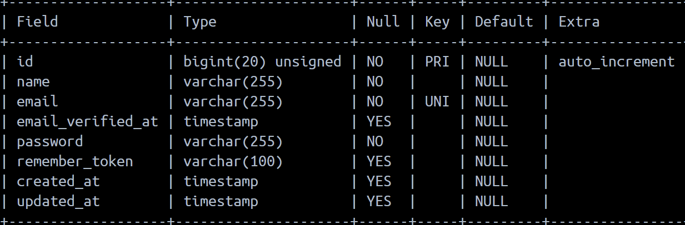
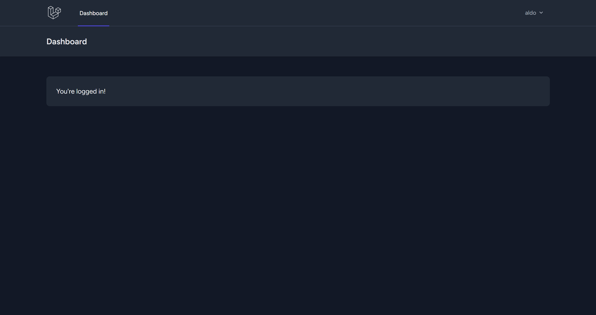

# Intro
Laravel memiliki Security Ecosystem.Umumny ada 3 package yang biasa digunakan 
1. Laravel Session(Default)
informasi yang disimpan dalam cookie
2. Laravel Passport (Oauth2 Authentication Provider)
Package yang lumayan kompleks biasa digunakan di web browser, mobile atau API.
3. Laravel Sanctum
Package yang lebih sederhana dibanding Passport. Biasa digunakan untuk SPA.


## User Model
By default, laravel telah menyediakan user model beserta file migrasi. Jalankan file migrasi

Hasil table pada user:

Sudah otomatis dibuatkan schemanya oleh laravel.

## Laravel Breeze
Laravel breeze adalah fitur sederhana untuk membuat proses authentication secara otomatis. Laravel breeze mendukung halaman registration, login, password reset, email verification dan password confirmation. Dia menngunakan blaze template yang didukung oleh css/tailwind.

Untuk menambahkan laravel-breeze:
```shell
composer require laravel/breeze=v1.26.2 --dev
```

kemudian instalasi laravel-breeze:
```shell
php artisan breeze:install
```

Pilih Blade with Alpine, dark mode (opsional), dan phpunit.
Setelah selesai nanti semua akan digenerate banyak file termasuk routes

Jalankan php artisan serve, nanti akan muncul tampilan untuk registrasi dan login. Coba registrasi maka nanti akunnya akan terdaftar.


Jadi cukup bagus menggunakan laravel-breeze. Sudah tergenerate dari controller, resource, route, hingga ke view.
