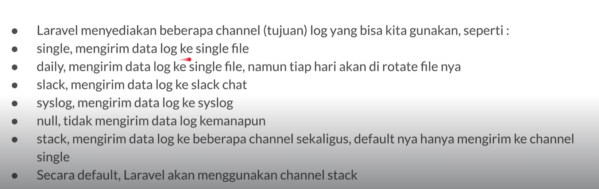

# Configuration

By default laravel menggunakan file config/logging.php sebagai konfigurasi loggingnya. Beberapa log channel:

Jadi by default laravel akan menggunakan stack dari stack itu akan dilempar ke single.